# Clear View Solution
 
## Equi Hire Architects Team

We are a team of software engineers from Microsoft Serbia passionate about software architecture. We have been practicing architectural katas within our team, drawing inspiration from books and videos by Neal Ford and Mark Richards. This time, we decided to challenge ourselves by participating in an official event.

- [Uros Milivojevic](https://www.linkedin.com/in/urosmilivojevic/)
- [Marjan Slavkovski](https://www.linkedin.com/in/marjan-s/)
- [Rastko Djordjevic](https://www.linkedin.com/in/rastko-djordjevic/)
- [Goran Zoranovic](https://www.linkedin.com/in/goranzoranovic/)

## Table of contents
  - [Company overview](#company-overview)
  - [Requirements](#requirements)
  - [Identifying architecture characteristics](#identifying-architecture-characteristics)
  - [Domain analysis](#domain-analysis)
  - [Architecture](#architecture)
  - [AI Backend](#ai-backend)
    - [AI Tips service](#ai-tips-service)
    - [Analysis of LLM Usage for AI-Tips](#analysis-of-llm-usage-for-ai-tips)
    - [Anonymization Service](#anonymization-service)
    - [Matching service](#matching-service)
    - [Scoring Logic](#scoring-logic)
  - [Integration](#integration)
  - [Unified API](#unified-api)
    - [Candidate Endpoint](#candidate-endpoint)
    - [Employer Endpoint](#employer-endpoint)
    - [Administrator Endpoint](#administrator-endpoint)
    - [Reporting Endpoint](#reporting-endpoint)
  - [Storage](#storage)
    - [Database](#database)
    - [Schema considerations](#schema-considerations)
    - [File Storage](#file-storage)
  - [External services](#external-services)
  - [Additional considerations](#additional-considerations)
    - [Evolvability](#evolvability)
    - [Scalability](#scalability)
    - [Premium Business model](#premium-business-model)

## Company overview

Diversity Cyber Council (https://www.diversitycybercouncil.com/) is a 501c3 Non-Profit that serves under-represented demographics in the tech industry by facilitating education, training, and staffing opportunities to establish a sustainable and diverse talent pipeline to the workforce.

## Requirements 

High level requirements are listed in this document:
[Requirements](https://docs.google.com/document/d/1jCHMAvgzqaYaAp09br12OC4ozpVXZR3s9ezgEqncZ9U/edit#heading=h.jsoimuz95gvo)

Additionally, through communication with stakeholders we found several other requirements:

- Due to the nature of our customer being a Non-Profit organization cost of the solution is an important aspect, and we should aim to reduce it.
- Based on market research done by our subject matter expert big volumes of users are not expected, so scalability is not very important.
- There is a possibility of potential adding new AI features in the future, although this is not a hard requirement we should aim to allow greater extendibility for this part of the system.
- System will be maintained by current Diversity Cyber Council IT team.

The following are our assumptions and considerations based on our understanding of the business problem and the client. These could be reviewed more with subject matter experts in the future to solidify our understanding but we are using them as given due to limited time constraints of the competition:
- The employee will be given the top candidates once per Job Ad. This requirement was made because it allows for easiest integration with other HR systems (no live updates that need tracking, no changes in candidates simplifies the response) which is an important ask from the perspective of the employer.
- Security of the system should be additionally heightened due to dealing with secure personal candidate data.
- Considering that our solution is based on AI technologies which are probabilistic by nature, we need to make sure that our solution gives good quality results which are not biased and are following responsible AI guidelines.

## Identifying architecture characteristics 

Taking into account all requirements we decided that 3 main characteristics for our solution should be: **Cost, Interoperability and Simplicity.** Cost and simplicity are paramount due to our client being a non-profit organization with limited resources available for funding implementation and maintenance of the solution. Considering that the main value proposition of our solution is allowing companies to seamlessly integrate ClearView within their HR systems, Interoperability is also chosen as a main characteristic of the system.

Besides these we consider *Fault-tolerance, Evolvabilty, Scalability, Testability, Workflow and Abstraction.*

Testability of the system is important for increasing security and reliability of our solution. We have higher security requirements due to dealing with very sensitive personal data (CVs). Additionally increased testability will help us with making sure that our AI driven solution gives good quality results.

Evolvability is also an important characteristic because of the requirement to potentially add new AI features in the future. AI technologies are rapidly changing and we need to allow our system to be ready for those changes.

Fault-tolerance is not the most important characteristic because even if our system temporarily stops operating due to a component failing it will not have big life related consequences and reliability is more important to us from availability. But on the other hand, we do have different types of users and many different parts of the system, so from a user experience perspective it would be good to not have some basic resistance in case some component fails.

After consulting with the subject matter expert regarding the expected volume of users, we concluded that with only 5000 candidates and several hundred employees scalability and elasticity are not driving characteristic. Our biggest processing bottleneck is the matching service, With the expected volume of users and the requirement that we only do the matching once per Job Ad we don't expect sudden changes in processing requirement, which also leads to elasticity not being our primary goal.

*Reliablity* is also important as a composite characteristic.


After careful consideration, we have decided that Service-Based architecture is one that best fits our requirements.

There were other styles which could be also good options like microkernel, microservices or event-driven, however, cost and simplicity were the main characteristics which made the difference.


|ADR #| 	Title| 	Why |	Trade-offs 	| Link |
|------|----------|-----|--------------|-----|	
|01 |	Chosen architecture characteristics: cost, interoperability, simplicity, fault-tolerance, and evolvability |	Prioritized cost, interoperability, simplicity, fault-tolerance, and evolvability based on problem statement.| 	May require trade-offs between simplicity and evolvability over time, potentially limiting flexibility as requirements grow. |	<a href="adr/adr01.md">ADR01</a>|
|02 |	Service-Based Architecture selected	|Service-based architecture chosen to align with prioritized characteristics (cost, fault-tolerance, scalability).| 	Increased complexity in service orchestration and operational overhead compared to a monolithic approach. This level of complexity is needed to allow enough evolvability of system.Reduced scalability compared to microservices of event-driven architecture to optimize more for cost and expected scale.| <a href="adr/adr02.md">ADR02</a>|


## Domain analysis
Before we defined components of the architecture we took a look at domain model to identify key domains which would help us in better organizing components and services in architecture.

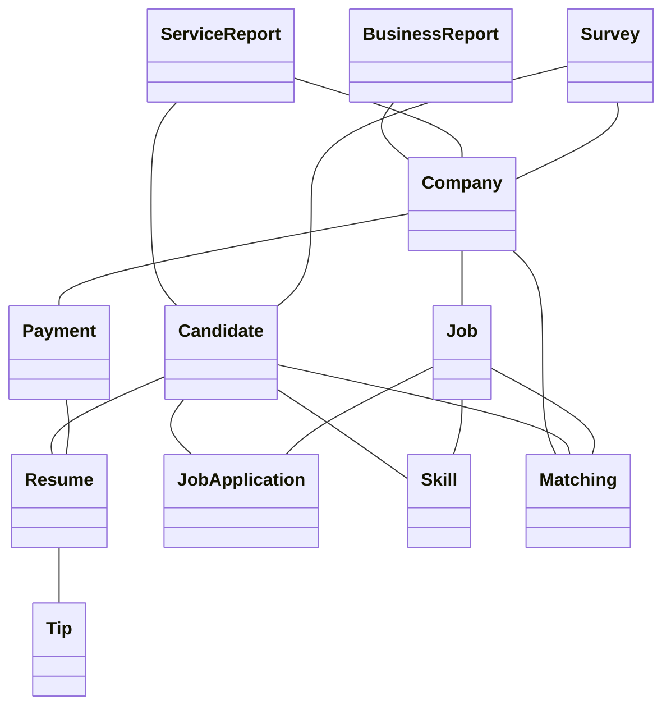
<div align="center"><i>Domain Model</i></div>
<br/>

Detailed model is available on <a href="models/domain_model.md">Domain Model</a> page.

We landed on next domains:
- **Candidate** : Covering flow related to candidate: creating profile, uploading and iterating on resume, overview of matches.
- **Employer** : Covering flow related to employer: creating profile, job, overview of matches, payment and download of full resumes.
- **AI Backend** : Covers the AI part of the architecture: Anonymization, AI Tips and Matching service.
- **Reporting**: Covering everything related to reports.
- **Survey**: Surveys for Candidate and Employer.
- **Administrator** : Admin flow covered.

|ADR #| 	Title| 	Why |	Trade-offs 	| Link |
|------|----------|-----|--------------|-------|	
|03 |	Organize components per domain| 	Organizes ClearView components into domain-specific groups (candidate, employer, AI backend, etc.) to separate concerns effectively and improve maintainability and testability.|	Requires managing inter-domain communication and potentially increasing complexity if domains grow interdependent. 	| <a href="adr/adr03.md">ADR03</a>|

## Architecture
### Top level architecture 

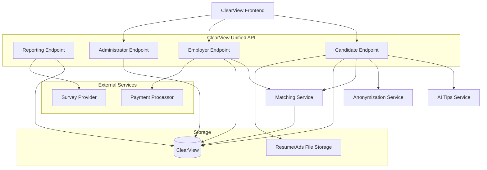
<div align="center"><i>Top Level Architecture - Component Diagram</i></div>
<br/>

- **ClearView Frontend** - top layer using unified APIs which are hiding complexity of the system below.
- **ClearView unified API** - top level abstraction to be used for integration with HR apps. Clear view can have its own front end hooking up to this layer.
- **Candidate Endpoint** - unified API component covering methods needed for Candidate flow.
- **Employer Endpoint** - unified API component covering methods for Employer flow.
- **Administrator Endpoint** - unified API component covering methods for Admin flow.
- **Reporting Endpoint** - unified API component covering methods needed for Monthly reporting.
- **Anonymization Service** - Service which is creating anonymized version of resume.
- **AI Tips Service** - Service providing tips for the Candidate resume.
- **Matching Service** - Service making actual matches based on skills extracted from job ads and resumes.
- **Resume/Ads File Storage** - Storage used for files.
- **ClearView database** - Relational database for rest of the data.
- **External services** - Payment processor and Survey Provider.

### Architecture Decision Records

Here is the condensed list of all ADRs we made during the process to came up with architecture we designed. Full ADRs can be found through links in the table.

| ADR # | Title                                                                                                      | Why                                                                                                                                                                            | Trade-offs                                                                                                                                                                                                                                                                                                    | Link to Detailed ADR                             |
| ----- | ---------------------------------------------------------------------------------------------------------- | ------------------------------------------------------------------------------------------------------------------------------------------------------------------------------ | ------------------------------------------------------------------------------------------------------------------------------------------------------------------------------------------------------------------------------------------------------------------------------------------------------------- | -------------------------------- |
| 01    | Chosen architecture characteristics: cost, interoperability, simplicity, fault-tolerance, and evolvability | Prioritized cost, interoperability, simplicity, fault-tolerance, and evolvability based on problem statement.                                                                  | May require trade-offs between simplicity and evolvability over time, potentially limiting flexibility as requirements grow.                                                                                                                                                                                  | <a href="adr/adr01.md">ADR01</a> |
| 02    | Service-Based Architecture selected                                                                        | Service-based architecture chosen to align with prioritized characteristics (cost, fault-tolerance, scalability).                                                              | Increased complexity in service orchestration and operational overhead compared to a monolithic approach. This level of complexity is needed to allow enough evolvability of system. Reduced scalability compared to microservices of event-driven architecture to optimize more for cost and expected scale. | <a href="adr/adr02.md">ADR02</a> |
| 03    | Organize components per domain                                                                             | Organizes ClearView components into domain-specific groups (candidate, employer, matching, etc.) to separate concerns effectively and improve maintainability and testability. | Requires managing inter-domain communication and potentially increasing complexity if domains grow interdependent.                                                                                                                                                                                            | <a href="adr/adr03.md">ADR03</a> |
| 04    | One relational database and one file-storage DB                                                            | Simplifies maintenance by reducing the number of databases, combining multiple domains into one relational DB.                                                                 | Resumes need separate file storage.	May compromise modularity and separation of concerns between domains, leading to potential scaling or data management challenges later. However big scalability is not expected so we feel comfortable in making this decision.                                           | <a href="adr/adr04.md">ADR04</a> |
| 05    | Split database by schema to decouple domains and improve security                                          | Improves fault-tolerance and security by separating candidate, employer, matching, and analytics data into schemas.                                                            | More complex database management, requiring careful handling of schema-specific optimizations and inter-schema queries.                                                                                                                                                                                       | <a href="adr/adr05.md">ADR05</a> |
| 06    | Analytics as part of regular database                                                                      | Simplifies architecture by embedding analytics within the regular database, avoiding real-time analytics complexity.                                                           | May limit future analytics capabilities if real-time or advanced analytics are needed, and could add extra load to the operational database. However, it should be fairly easy to move this data to separate database if needed.                                                                              | <a href="adr/adr06.md">ADR06</a> |
| 07    | Split Anonymization, AI tips and matching services                                                         | Decouples Anonymization, AI tips and matching services, making the system simpler and easier to scale independently.                                                           | Requires coordination between services and careful orchestration of dependencies if they need to interact, adding complexity in integration. On the other hand we improve separation of concerns, maintaining and testability.                                                                                | <a href="adr/adr07.md">ADR07</a> |
| 08    | Use lightweight authentication (OAuth2, Shiro)                                                             | Implements simple and lightweight authentication to reduce complexity while securing access to services.                                                                       | May require upgrades to a more robust solution if security or user management needs increase, adding migration overhead later.                                                                                                                                                                                | <a href="adr/adr08.md">ADR08</a> |
| 09    | Use Third party solution for Survey and Payment                                                            | There are good existing solutions for this problem so we can reuse and reduce costs.                                                                                           | Hard to customize and extend, but no maintenance and cost is low.                                                                                                                                                                                                                                             | <a href="adr/adr09.md">ADR09</a> |

## AI Backend

### AI Tips service

Tips are generated based on uploaded resume, with a goal to improve quality of it and help candidate in finding a job.
This will be achieved through improvements in:

- Quantifying results
- Performance focus evaluation
- Skill Level Estimation - this will also help our skill extraction system
- Language Enhancement and Clarification**
- Formatting Suggestions
and many others

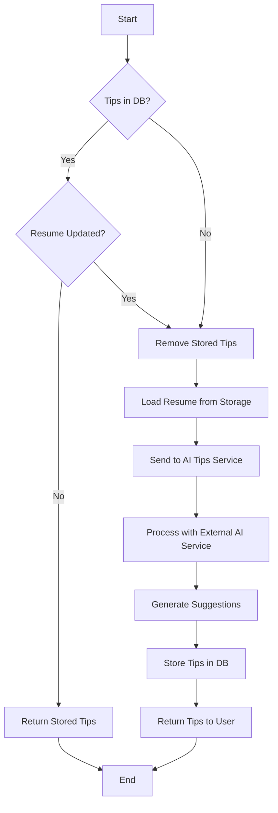
<div align="center"><i>AI Tips - Flow Diagram</i></div>
<br/>

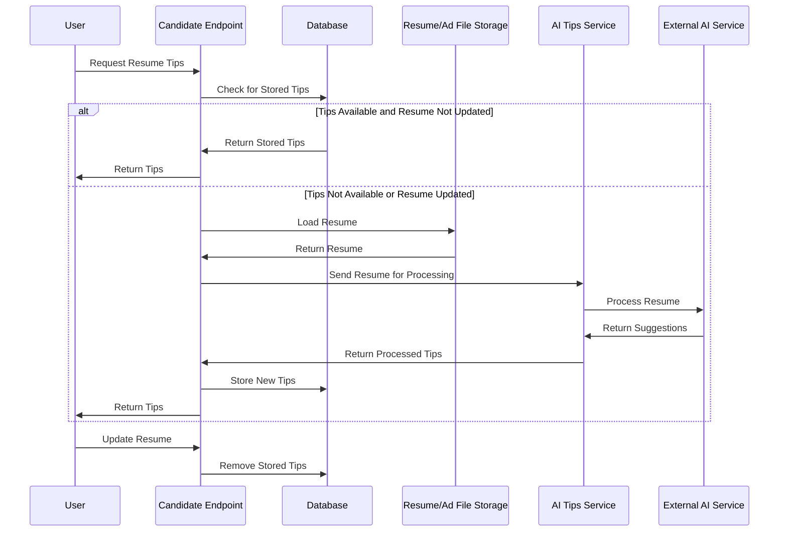
<div align="center"><i>AI Tips - Sequence Diagram</i></div>
<br/>

### Analysis of LLM Usage for AI-Tips

#### Pros

- **Advanced language understanding**: LLMs can comprehend complex resume structures and extract relevant information accurately.
- **Contextual awareness**: LLMs can provide suggestions based on industry standards, job market trends, and best practices in resume writing.
- **Flexibility**: LLMs can adapt to various resume formats and styles without requiring specific templates.
- **Continuous improvement**: As LLMs are updated, the quality of suggestions can improve without significant changes to the system architecture.
- **Multilingual support**: LLMs can potentially provide tips for resumes in multiple languages.

#### Cons

- **Computational cost**: Processing resumes through LLMs can be resource-intensive and potentially expensive, especially for large volumes of requests.
- **Latency**: The time required to generate suggestions using LLMs might be higher compared to rule-based systems, potentially affecting user experience.
- **Inconsistency**: LLMs may sometimes produce inconsistent or irrelevant suggestions, requiring additional validation or filtering mechanisms.

#### Related ADRs

|ADR #| 	Title| 	Why |	Trade-offs 	| Link |
|------|----------|-----|--------------|------|
|07 |	Split Anonymization, AI tips and matching services |	Decouples Anonymization, AI tips and matching services, making the system simpler and easier to scale independently.  |	Requires coordination between services and careful orchestration of dependencies if they need to interact, adding complexity in integration. On the other hand we improve separation of concerns, maintaining and testability.|	<a href="adr/adr07.md">ADR07</a>|

### Anonymization Service

One of the core features of ClearView is its ability to **reduce bias** in the hiring process through the **anonymization of candidate resumes**. This feature ensures that employers focus on the skills and qualifications of candidates rather than on potentially bias-inducing personal information such as names, contact details, gender, or other identifiable attributes. The **Anonymization Service**, powered by **Large Language Models (LLMs)**, is a critical component in achieving this goal, enabling a fairer and more inclusive recruitment process.

#### How the Anonymization Process Works

1. **Candidate Submission**  
   When a candidate submits their resume to ClearView, the resume typically contains personal and professional information, such as their full name, contact details, education, and work experience. This raw resume, while informative, carries the risk of introducing unconscious bias into the hiring process. 

2. **Anonymization Service Powered by LLMs**  
   Upon receiving the resume, ClearView’s **Anonymization Service** is automatically triggered. The service, utilizing **Large Language Models (LLMs)**, intelligently analyzes the resume to detect and anonymize sensitive personal information. These advanced models allow the system to:
   - Identify personal identifiers such as **names**, **contact details**, **gender**, **date of birth**, and **photographs**, even if presented in varied formats or contexts.
   - Maintain the **semantic integrity** of the resume, ensuring that anonymized resumes still convey the full scope of a candidate’s professional experience and skills.

   The LLM’s ability to understand context ensures that the anonymization process is thorough and adaptable, handling diverse resume formats and terminology with ease. While the LLM removes personal details, it preserves critical information such as **work experience**, **skills**, **education**, and **certifications**, ensuring that the anonymized resume remains informative.

3. **Compelling Anonymized Resume Creation**  
   The use of LLMs not only allows for effective anonymization but also enables the creation of a **compelling, professionally formatted anonymized resume**. The LLM enhances the presentation of the anonymized content by:
   - **Reformatting** the candidate’s experience and skills to emphasize qualifications that are most relevant to the job posting.
   - Ensuring a **consistent and polished presentation** across all anonymized resumes, so employers receive standardized resumes that focus solely on the candidates' qualifications.
   - Adapting the text to maintain the **flow and coherence** of the resume, even after personal information has been removed, ensuring that it is easy for employers to read and evaluate.

4. **Integration with Matching Data**  
   After the anonymization process is complete, the resume is presented to employers alongside the **matching data** generated by ClearView’s skill-matching service. This includes a match score based on the candidate’s qualifications and how well they align with the job’s requirements. Employers, therefore, see only anonymized resumes and objective data, enabling them to make informed decisions without bias.

#### Importance of LLM-Based Anonymization in Reducing Bias

Using **LLM-powered anonymization** significantly enhances ClearView’s ability to reduce bias by:
- **Contextual Understanding**: LLMs are capable of understanding the context in which personal details are presented, ensuring that all identifiable information is accurately removed while retaining important professional details.
- **Eliminating Bias**: By stripping away personal identifiers, ClearView ensures that employers focus on **what matters most**—the candidate’s skills, qualifications, and experience—without being influenced by irrelevant details like name, gender, or ethnicity.
- **Consistency Across Resumes**: LLMs enable the creation of **standardized anonymized resumes**, giving all candidates an equal opportunity to present themselves in the best possible light without the risk of bias creeping into the review process.

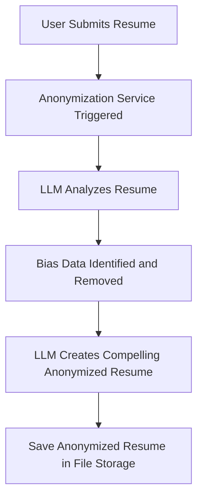
<div align="center"><i>Resume Anonymization - Flow Diagram</i></div>

#### Conclusion

In ClearView, the **Anonymization Service**, powered by **LLMs**, plays a pivotal role in ensuring **fair and unbiased hiring practices**. By utilizing the capabilities of Large Language Models to intelligently anonymize resumes and generate a consistent, professional presentation, ClearView enables employers to make objective, data-driven decisions. The combination of LLM-powered anonymization and skill-matching data ensures that every candidate is evaluated based on their qualifications alone, fostering a more diverse and inclusive recruitment process.

### Matching service

The Matching Service in ClearView is designed to process candidate resumes and job advertisements to extract skills and match them, providing a score that indicates the suitability of a candidate for a job. The service is built with flexibility in mind, using **Cosine Similarity** as the default matching algorithm, but allowing for other strategies such as **LLM-based matching** if needed.

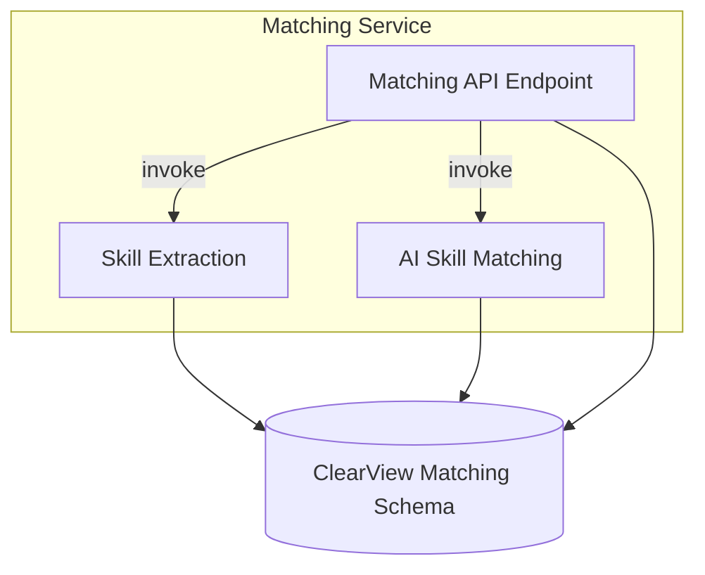
<div align="center"><i>Matching Service - Component Diagram</i></div>
<br/>

#### Matching API Endpoint

The main entry point to the Matching Service. It provides methods to:

- **Skill Extraction:** This component takes resumes and job descriptions and extracts skills from them. These skills are stored in the ClearView database for future use in matching.
- **AI Skill Matching:** This component compares candidate skills with job ad skills using Cosine Similarity as the default algorithm. The system calculates a matching score (1-100%) based on the similarity of the skills.

#### Triggering
Matching is done per job advertisement once it is closed to optimize cost. It could be also triggered on demand if business needs are such. We want to avoid multiple passes and redundant processes this way. 

#### Matching Process

Matching is done for a job in a loop for all candidates . Process for single candidate is depicted on flowchart below.


<div align="center"><i>Matching Process - Flow Diagram</i></div>
<br/>

#### Matching API

Below is a simplified table for the Matching API methods. These are proposals on how we think the methods should look like; however, this is just an example and method names and types will vary depending on the implementation. For more details, please refer to the detailed [API documentation file](/apis/matching_api.md).

| Method        | Endpoint                 | Description                        |
|---------------|--------------------------|------------------------------------|
| GET           | /api/matching/jobs       | Retrieve a list of jobs.           |
| POST          | /api/matching/jobs       | Create a new job listing.          |
| GET           | /api/matching/candidates | Retrieve a list of candidates.     |
| POST          | /api/matching/match      | Match a candidate to a job.        |
| GET           | /api/matching/candidates/{candidate_id}/skills | Fetch the extracted skills for a candidate based on their CandidateId. |

#### Skill extraction

Skill extraction is triggered before matching to gather required skills from job add and candidate skills from resume.
Extraction needs to be done using AI model, in our case LLM which transforms resume or add into map of skill descriptions. [More details](apis/skills_extraction.md)

### Scoring Logic
Scoring candidates against job ads is a complex task, with many potential approaches. Given ClearView’s emphasis on cost-efficiency, we favor solutions that are cost-effective while providing the flexibility to adopt different strategies.

##### Cosine Similarity

Advantages:
- Low cost to run and implement.
- Predictable and reliable with consistent performance.
- Provides good latency and scalability for real-time processing.

Disadvantages:
- Limited understanding of nuanced relationships between skills.

#### LLM Similarity

Advantages:

- Can capture more complex relationships between skills and job requirements (e.g., inferred skills, context).

Disadvantages:

- Expensive to run and can introduce latency.
- May “hallucinate” results and lack reliability in some cases.

Decision:

For the initial implementation, **Cosine Similarity** will be used due to its cost-efficiency and predictability. However, the system will be designed to support alternative matching strategies such as **LLM-based matching**. This flexibility will allow us to switch or enhance the matching logic as the system evolves.

Here is a class diagram representing the Scoring Logic using the Strategy Pattern for implementing both LLM Strategy and Cosine Similarity Strategy.

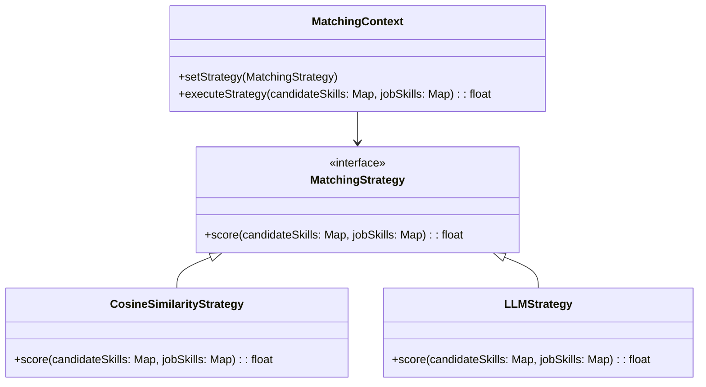
<div align="center"><i>Scoring Logic - Class Diagram</i></div>
<br/>

Explanation:

- MatchingContext: This class represents the context in which different matching strategies (Cosine Similarity or LLM) can be applied. It has:
    - A method ```setStrategy(MatchingStrategy)``` to set the desired strategy (either Cosine Similarity or LLM).
    - A method ```executeStrategy(candidateSkills, jobSkills)``` to invoke the strategy's scoring logic with the candidate's skills and the job's required skills.
- MatchingStrategy: This is an interface that defines the common method ```score(candidateSkills, jobSkills)```, which both strategies must implement. 
- CosineSimilarityStrategy: Implements the ```MatchingStrategy``` interface, providing a specific implementation of ```score()``` using Cosine Similarity to compare the candidate's skills and the job's required skills.
- LLMStrategy: Also implements the ```MatchingStrategy``` interface, but the ```score()``` method uses LLM-based logic to match the skills.

**Potential Improvement - Hybrid Matching: Cosine + LLM**

In case we figure out that Cosine Similarity is not producing good enough results, but we cannot switch directly to LLM because it would be to costly to run LLM over entire database, we could do hybrid solution. Idea is to filter out first set of candidates using Cosine Similarity and then use fine grained matching using LLM on top X matches. This way we would reduce costs but still have higher quality matches.

Process is depicted in the flowchart below.


<div align="center"><i>Hybrid Matching - Flow Diagram</i></div>
<br/>

## Integration

The [diagram](/appendix/integration.md) illustrates how ClearView integrates with external systems such as third-party payment processors and HR systems. ClearView’s architecture is designed to facilitate seamless communication with these systems while maintaining a modular and scalable structure.

1. **Payment Integration**:
   - We rely on a third-party payment processor to manage the complexities of payment handling. This allows us to focus on business logic while ensuring that the payment system is secure, reliable, and compliant with financial regulations.
   - The **Payment Processing** module is triggered when employers attempt to unlock candidate profiles. The integration is structured as follows:
      - The **Employer Endpoint** triggers the payment process.
      - Once a payment is initiated via the **Payment Gateway**, the system checks if the payment is successful.
      - If successful, access to the candidate's profile is unlocked. In the event of failure, the employer is notified and given an option to retry.
2. **HR System Integration**:
   - ClearView offers flexible options for integrating with existing HR systems. Employers can either use the ClearView web application or integrate directly via the **ClearView Unified API**.
   - The **HR System Integration** module ensures that job advertisements and candidate-related data can be synchronized between ClearView and the employer’s HR systems:
      - Employers can create, update, or view job ads via the **Employer Endpoint**, which synchronizes with the HR system.
      - Changes made in ClearView are automatically reflected in the HR system and vice versa, ensuring data consistency across platforms.

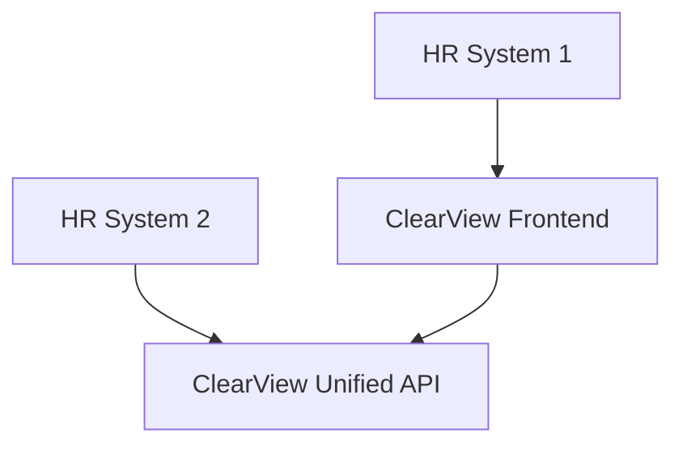
<div align="center"><i>HR System Integration - Flow Diagram</i></div>
<br />

3. **ClearView Unified API**:
   - The ClearView Unified API provides a standardized interface for external systems to interact with ClearView. This API supports operations related to candidates, employers, administrators, and reporting:
      - **Candidate Endpoint**: Manages candidate profiles and interactions, such as uploading resumes and retrieving matched job results.
      - **Employer Endpoint**: Handles job postings, payment processing, and candidate unlocking.
      - **Administrator Endpoint**: Provides access for system management and reporting functionalities.
      - **Reporting Endpoint**: Gathers and presents system usage and performance data to administrators and employers.
4. **Data Storage and Synchronization**:
   - The **ClearView Database** serves as the central data repository for structured data such as job ads, candidate profiles, and employer information.
   - **Resume File Storage** is used to store large documents, such as resumes, in a more efficient and scalable manner.
   - Integration with both the database and the resume storage system ensures that data flows smoothly between various ClearView modules and external systems.

By leveraging a modular and API-driven approach, ClearView ensures that external systems can interact with the platform while maintaining secure and reliable data flows across services.

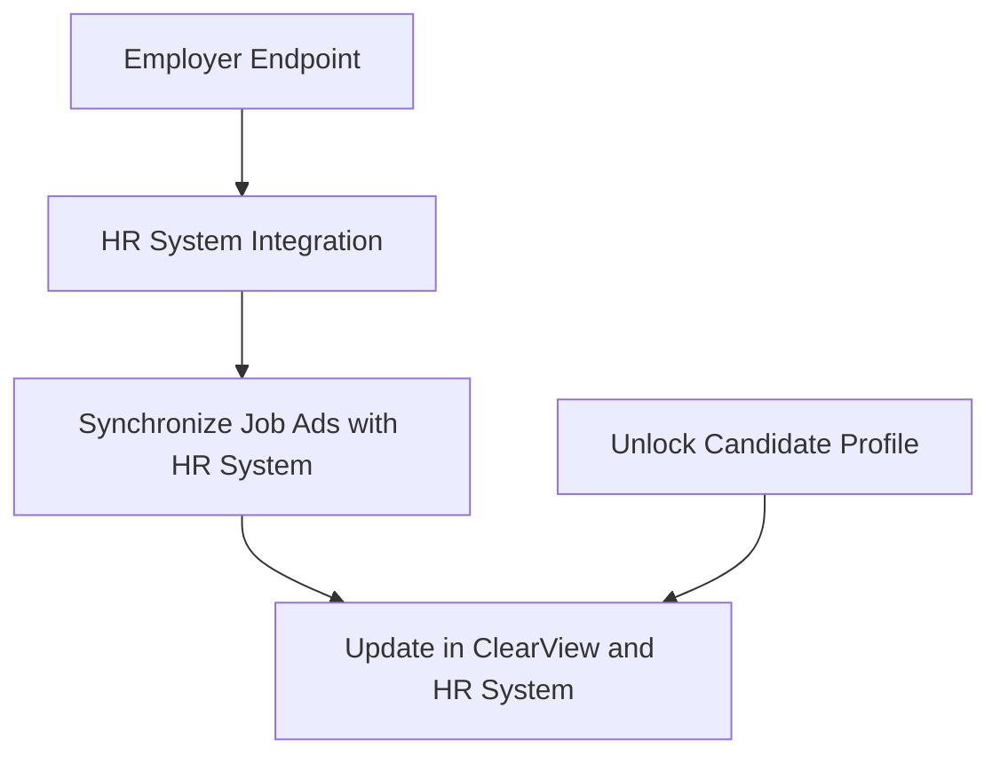

| ADR # | Title                                           | Why                                                                                                  | Trade-offs                                                                                                                                                                                   | Link                             |
| ----- | ----------------------------------------------- | ---------------------------------------------------------------------------------------------------- | -------------------------------------------------------------------------------------------------------------------------------------------------------------------------------------------- | -------------------------------- |
| 08    | Use Third party solution for Survey and Payment | There are good existing solutions for this problem so we can reuse and reduce costs.                 | Hard to customize and extend, but no maintenance and cost is low.                                                                                                                            | <a href="adr/adr08.md">ADR08</a> |

## Unified API

### Candidate Endpoint

#### Related ADRs

| ADR # | Title                               | Why                                                                                                                                                                            | Trade-offs                                                                                                                                                                                   | Link                             |
| ----- | ----------------------------------- | ------------------------------------------------------------------------------------------------------------------------------------------------------------------------------ | -------------------------------------------------------------------------------------------------------------------------------------------------------------------------------------------- | -------------------------------- |
| 03    | Organize components per domain      | Organizes ClearView components into domain-specific groups (candidate, employer, matching, etc.) to separate concerns effectively and improve maintainability and testability. | Requires managing inter-domain communication and potentially increasing complexity if domains grow interdependent.                                                                           | <a href="adr/adr03.md">ADR03</a> |

#### Account Management

Below is a simplified table for the Account Management API methods. These are intended to provide an example of how the account management endpoints could be structured, but the exact method names and types may vary based on the final implementation. For more details, please refer to the [detailed Account Management API documentation](apis/account_management_api.md).

| Method        | Endpoint                  | Description                                        |
|---------------|---------------------------|----------------------------------------------------|
| POST          | /api/candidates/register  | Register a new candidate.                          |
| POST          | /api/candidates/login     | Log in a registered candidate.                     |
| GET           | /api/candidates/profile   | Retrieve the profile of the authenticated candidate.|
| PUT           | /api/candidates/profile   | Update the profile of the authenticated candidate.  |

#### Resume Management

Below is a table summarizing the key API methods for the Resume Management module. These methods illustrate how resumes are uploaded, retrieved, updated, and managed in the system. The exact endpoints and implementations may vary, but this table provides a general overview of the available operations. For more details, please refer to the [detailed Account Management API documentation](apis/resume_management_api.md).

| Method        | Endpoint                   | Description                                         |
|---------------|----------------------------|-----------------------------------------------------|
| POST          | /api/candidates/resume      | Upload a new resume in supported formats.           |
| GET           | /api/candidates/resume   | Retrieve the original or anonymized version of a resume by ID. |
| PUT           | /api/candidates/resume   | Update an existing resume with new information.     |
| DELETE        | /api/candidates/resume   | Delete a specific resume from the system.           |

#### Anonymized Resume Management

The following table summarizes the key API methods for the Anonymized Resume Management module. These methods illustrate how anonymized resumes are created, retrieved, updated, and managed in the system. The exact endpoints and implementations may vary, but this table provides a general overview of the available operations. For more details, please refer to the [detailed Account Management API documentation](apis/anon_resume_management.md).

| Method        | Endpoint                        | Description                                                                                  |
|---------------|---------------------------------|----------------------------------------------------------------------------------------------|
| POST          | /api/candidates/anonymized      | Upload an anonymized version of the candidate's resume.                                      |
| GET           | /api/candidates/anonymized      | Retrieve the uploaded anonymized resume.                                                     |
| DELETE        | /api/candidates/anonymized      | Delete the uploaded anonymized resume.                                                       |

#### AI Tips

The following table summarizes the key API method for receiving resume improvement tips. This method allows authenticated candidates to get personalized suggestions for enhancing their resumes.

| Method        | Endpoint                          | Description                                                                                   |
|---------------|-----------------------------------|-----------------------------------------------------------------------------------------------|
| GET           | /api/candidates/resume/tips       | Provides resume improvement tips for authenticated candidates.                                |

#### Job Matching

Below is a table summarizing the key API methods for the Job Matching module. These methods illustrate how job matches are retrieved, filtered, and detailed information about jobs is accessed. The exact endpoints and implementations may vary, but this table provides a general overview of the available operations. For more details, please refer to the [detailed Job Matching API documentation](apis/job_matching_api.md).

| Method        | Endpoint                              | Description                                                                                  |
|---------------|---------------------------------------|----------------------------------------------------------------------------------------------|
| GET           | /api/candidates/jobs/matches          | Retrieve a list of job matches based on the candidate's profile and preferences.             |
| GET           | /api/candidates/jobs/matches/filter   | Retrieve a list of job matches based on specific filters.                                    |
| GET           | /api/candidates/jobs/{jobId}          | Retrieve detailed information about a specific job.                                          |


### Employer Endpoint

#### 1. Overview
The Employer and Payment module needs to integrate seamlessly within the ClearView platform, focusing on:
Employer registration and role management.
Uploading job ads and managing candidate selection.
Processing payments for accessing candidate profiles and services.
Enabling HR systems integration for better job ad synchronization.
Tracking employer activity, including interviews and candidate progression.
This solution will involve a set of API CRUD operations, a payment gateway integration, and the necessary database structure to manage the employer's data, payment records, and job posting history.

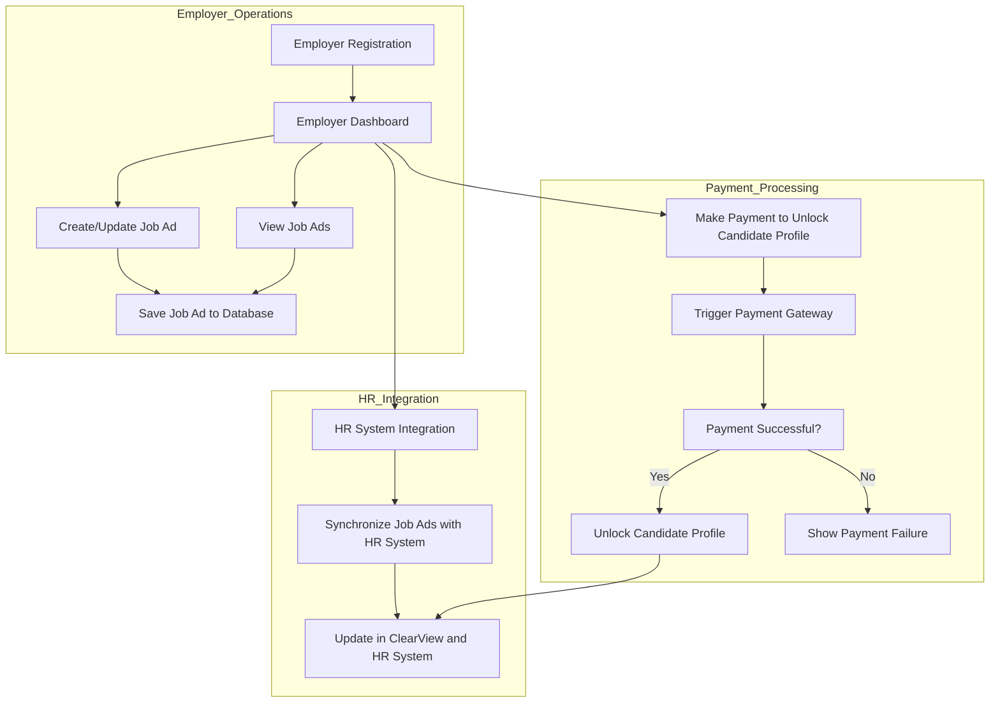
<div align="center"><i>Employer Functionality - Component Diagram</i></div>
<br/>

**Related ADRs**

| ADR # | Title                               | Why                                                                                                                                                                            | Trade-offs                                                                                                                                                                                   | Link                             |
| ----- | ----------------------------------- | ------------------------------------------------------------------------------------------------------------------------------------------------------------------------------ | -------------------------------------------------------------------------------------------------------------------------------------------------------------------------------------------- | -------------------------------- |
| 03    | Organize components per domain      | Organizes ClearView components into domain-specific groups (candidate, employer, matching, etc.) to separate concerns effectively and improve maintainability and testability. | Requires managing inter-domain communication and potentially increasing complexity if domains grow interdependent.                                                                           | <a href="adr/adr03.md">ADR03</a> |

#### 2. Employer Registration and Management

The Employer system will handle the following:
Employer Registration:
New employers will register using the platform.
On successful registration, the system will autofill company details using external services (e.g., company data APIs).
Employers can manage their profiles and hiring roles.
Employer Dashboard:
Employers will have a dashboard where they can view job postings, select candidates, and monitor payments.
Employer Job Ad Management:
Employers will create, update, or delete job ads through the system.
The AI system will use job ads to match with candidate profiles, ensuring anonymization and alignment with S.M.A.R.T. goals.

#### 3. Payment Processing

The Payment System will be a critical part of ClearView to ensure employers pay for services and unlock candidate profiles.
- Payment Triggers:
Employers can browse anonymized candidates, but to unlock full profiles and contact information, they need to make a payment.
Payments will also be triggered for accessing advanced services, like AI tips or DEI consultant services.
- Payment Gateway Integration:
The platform will integrate with third-party payment gateways (e.g., Stripe, PayPal).
All payment transactions will be securely stored, and receipts will be issued via email.
- Subscription Plans:
Employers can subscribe to monthly plans, giving them access to a specific number of candidate profiles or advanced services.
Plan management (viewing/upgrading/downgrading subscriptions) will be available through the employer's dashboard.

#### 4. HR System Integration

ClearView integrates with HR systems in two main ways, offering flexibility for different business needs:

1. **ClearView App for Employers**  
   The **ClearView app** provides a fully-featured, intuitive interface for employers to manage job postings, view anonymized candidate resumes, and access match scores generated by ClearView's AI engine. This method is ideal for employers who prefer a **plug-and-play solution** with minimal setup and no integration work. It enables HR teams to quickly manage recruitment processes without the need for additional development.

2. **Service API Integration**  
   For organizations with existing HR systems, ClearView offers integration via a **Service API**, allowing seamless communication between HR platforms and ClearView. This API enables organizations to manage job ads, retrieve matched candidates, and synchronize recruitment data without manual intervention. The API provides access to ClearView's core features such as job management, candidate matching, and anonymized resume retrieval, making it ideal for larger companies needing custom integration.

Both methods ensure that ClearView can fit into different organizational structures—offering a simple app-based solution for small businesses, while also supporting complex HR workflows through the Service API for larger enterprises. An ADR detailing this integration has been created for further reference.

#### 5. Unified API CRUD Operations

The API will enable the following operations:

##### Employer

Below is a table summarizing the key API methods for the Employer module. These methods illustrate how employers can register, retrieve details, update information, and deactivate their profiles. The exact endpoints and implementations may vary, but this table provides a general overview of the available operations. For more details, please refer to the [detailed Employer API documentation](apis/employer_api.md).

| Method        | Endpoint                        | Description                                                                                  |
|---------------|---------------------------------|----------------------------------------------------------------------------------------------|
| POST          | /api/employer                   | Register a new employer and autofill company details.                                        |
| GET           | /api/employer/{employer_id}     | Retrieve the employer's account information, including job ads and payment history.          |
| PUT           | /api/employer/{employer_id}     | Update the employer's profile with new information.                                          |
| DELETE        | /api/employer/{employer_id}     | Deactivate the employer's profile.                                                           |
| GET           | /api/employer/{employer_id}/{candidate_id}/anonymized     | Download anonymized candidate resume profile.                                                           |
| GET           | /api/employer/{employer_id}/candidates/{candidate_id}/resume     | Download unlocked candidate resume                                                            |


**Related ADRs**

| ADR # | Title                               | Why                                                                                                                                                                            | Trade-offs                                                                                                                                                                                   | Link                             |
| ----- | ----------------------------------- | ------------------------------------------------------------------------------------------------------------------------------------------------------------------------------ | -------------------------------------------------------------------------------------------------------------------------------------------------------------------------------------------- | -------------------------------- |
| 03    | Organize components per domain      | Organizes ClearView components into domain-specific groups (candidate, employer, matching, etc.) to separate concerns effectively and improve maintainability and testability. | Requires managing inter-domain communication and potentially increasing complexity if domains grow interdependent.                                                                           | <a href="adr/adr03.md">ADR03</a> |

The `Download Unlocked Candidate Resume` method allows an employer to retrieve an unlocked candidate resume that has been paid for or otherwise authorized.

##### Job Ads

Below is a table summarizing the key API methods for the Job Ads module. These methods illustrate how employers can create, retrieve, update, and remove job advertisements. The exact endpoints and implementations may vary, but this table provides a general overview of the available operations.

| Method        | Endpoint                                  | Description                                                                                  |
|---------------|-------------------------------------------|----------------------------------------------------------------------------------------------|
| POST          | /api/employer/{employer_id}/job           | Create a new job ad. The request body should contain the details of the job to be posted.    |
| GET           | /api/employer/{employer_id}/jobs          | Retrieve all job ads for the specified employer.                                             |
| PUT           | /api/employer/{employer_id}/job/{job_id}  | Update an existing job ad. The request body should include the fields to be updated.         |
| DELETE        | /api/employer/{employer_id}/job/{job_id}  | Remove a job ad from the employer's list.                                                    |

##### Payments

Below is a table summarizing the key API methods for the Payments module. These methods illustrate how employers can make payments and retrieve payment history. The exact endpoints and implementations may vary, but this table provides a general overview of the available operations.

| Method        | Endpoint                                  | Description                                                                                  |
|---------------|-------------------------------------------|----------------------------------------------------------------------------------------------|
| POST          | /api/employer/{employer_id}/payment       | Make a payment for unlocking candidate profiles or other services.                           |
| GET           | /api/employer/{employer_id}/payments      | Retrieve the history of payments made by the employer.                                       |

### Administrator Endpoint

#### Administrator Endpoint Overview

The Administrator Endpoint is designed to provide system administrators with special privileges for managing users, candidates, employers, and the skill-matching configuration. This includes the ability to update hire statuses, modify user data, and change the matching strategy (e.g., switch between Cosine Similarity and LLM-based matching).

**Related ADRs**

| ADR # | Title                               | Why                                                                                                                                                                            | Trade-offs                                                                                                                                                                                   | Link                             |
| ----- | ----------------------------------- | ------------------------------------------------------------------------------------------------------------------------------------------------------------------------------ | -------------------------------------------------------------------------------------------------------------------------------------------------------------------------------------------- | -------------------------------- |
| 03    | Organize components per domain      | Organizes ClearView components into domain-specific groups (candidate, employer, matching, etc.) to separate concerns effectively and improve maintainability and testability. | Requires managing inter-domain communication and potentially increasing complexity if domains grow interdependent.                                                                           | <a href="adr/adr03.md">ADR03</a> |
| 04    | Unified API with multiple endpoints | Simplifies architecture by having a single API with various endpoints for different functionalities.                                                                           | Can lead to large, complex APIs over time, making it harder to maintain clear boundaries between services. Reducing number of API services to one instead of multiple (one for each domain). | <a href="adr/adr04.md">ADR04</a> |

##### Administrator Endpoint Methods

The following table summarizes the key API methods for the Administrator module. These methods illustrate how administrators can update various entities within the system. The exact endpoints and implementations may vary, but this table provides a general overview of the available operations. For more details, please refer to the [detailed Administrator API documentation](apis/admin_api.md).

| Method        | Endpoint                                              | Description                                                                                  |
|---------------|-------------------------------------------------------|----------------------------------------------------------------------------------------------|
| PUT           | /api/admin/updateCandidateHireStatus/{candidateId}    | Update the hire status of a candidate for a specific job.                                     |
| PUT           | /api/admin/updateUser/{userId}                        | Update general user data, including for candidates and employers.                            |
| PUT           | /api/admin/updateCandidate/{candidate_id}             | Update candidate details using the candidate's ID.                                           |
| PUT           | /api/admin/updateEmployer/{employer_id}               | Update employer-related data using the employer's ID.                                        |
| PUT           | /api/admin/updateMatchingStrategyConfig/{strategy}    | Update the matching strategy configuration for the skill-matching service.                   |

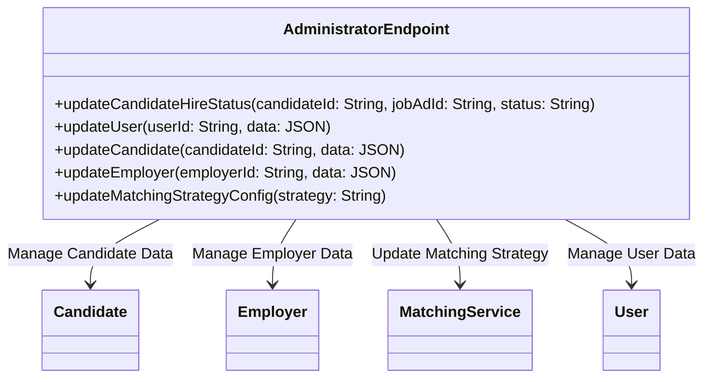
<div align="center"><i>Administrator Functionality - Class Diagram</i></div>
<br/>

How It Works:

**AdministratorEndpoint:** A centralized API that provides special privileges to system administrators. Each method manages a different aspect of the system:

- **Candidate:** Admins can update candidate-specific data (skills, resumes) and hire statuses.
- **Employer:** Admins can modify employer-related data (company details, job posts).
- **MatchingService:** Admins can change the skill-matching strategy (e.g., switch between Cosine Similarity and LLM).
- **User:** Admins can update general user data for both candidates and employers.

### Reporting Endpoint

The Reporting API in ClearView is divided into two key sections: **Business Reporting** and **Service Review**. These sections provide crucial insights into system performance, user engagement, and the health of services.

#### 1. Business Reporting

The **Business Reporting** section focuses on metrics related to users, job postings, and the effectiveness of ClearView’s matching process. It helps employers and system administrators gain insights into the candidate pool, job activity, and the accuracy of the matching algorithm, providing data-driven feedback on the platform’s performance. Key API methods include:

#### Business Reporting API Methods

The following table summarizes the key API methods for the Business Reporting module. These methods provide insights into system performance, user engagement, and the effectiveness of ClearView’s matching process. The exact endpoints and implementations may vary, but this table provides a general overview of the available operations. For more details, please refer to the [detailed Business Reporting API documentation](apis/business_reporting_api.md).

| Method        | Endpoint                                      | Description                                                                                  |
|---------------|-----------------------------------------------|----------------------------------------------------------------------------------------------|
| GET           | /api/reporting/business/activeCandidates      | Retrieve the number of active candidates over a given period.                                |
| GET           | /api/reporting/business/activeEmployers       | Retrieve the number of active employers over a given period.                                 |
| GET           | /api/reporting/business/activeJobs            | Retrieve the number of active job postings over a given period.                              |
| GET           | /api/reporting/business/scoreOfferComparison  | Histogram of scores and job offers.                                                          |
| GET           | /api/reporting/business/scoreRejectComparison | Histogram of scores and job rejections.                                                      |
| GET           | /api/reporting/business/demographicOfferRejectBreakdown | Breakdown of offers and rejections by demographics.                                          |
| GET           | /api/reporting/business/employerSurvey    | Survey data from employers.                                                                  |
| GET           | /api/reporting/business/candidateSurvey   | Survey data from candidates.                                                                 |

#### 2. Service Review

The **Service Review** section monitors the health and performance of ClearView’s services, including metrics related to errors, downtime, and performance of the **LLM services**. Key API methods include:

##### Service Review API Methods

The following table summarizes the key API methods for the Service Review module. These methods provide insights into system errors, crashes, downtime, and the performance of LLM services. The exact endpoints and implementations may vary, but this table provides a general overview of the available operations. For more details, please refer to the [detailed Service Review API documentation](apis/service_review_api.md).

| Method        | Endpoint                                      | Description                                                                                  |
|---------------|-----------------------------------------------|----------------------------------------------------------------------------------------------|
| GET           | /api/reporting/service/errorsOverview         | Provides a breakdown of errors across pages, endpoints, or services.                         |
| GET           | /api/reporting/service/crashesOverview        | Retrieves data on system crashes, providing an overview of system stability.                 |
| GET           | /api/reporting/service/serviceDowntime        | Provides details on service downtime, broken down by different services.                     |
| GET           | /api/reporting/service/llmLatency             | Reports on the latency of LLM services.                                                      |
| GET           | /api/reporting/service/llmCost                | Provides cost data related to running LLM services.                                          |
| GET           | /api/reporting/service/llmCapacity            | Reports on the capacity usage of the LLM service.                                            |
| POST          | /api/reporting/service/runDataAggregation/{dateFrom}/{dateTo} | Triggers the backend process to gather monthly data for a specified time range.              |


## Storage
### Database
Database is designed by following principles explained in ADRs below.

|ADR #| 	Title| 	Why |	Trade-offs 	| Link |
|------|----------|-----|--------------|-----|	
|04 |	One relational database and one file-storage DB |	Simplifies maintenance by reducing the number of databases, combining multiple domains into one relational DB.| Resumes need separate file storage.	May compromise modularity and separation of concerns between domains, leading to potential scaling or data management challenges later. However big scalability is not expected so we feel comfortable in making this decision.	|<a href="adr/adr04.md">ADR04</a>|
|05 |	Split database by schema to decouple domains and improve security|	Improves fault-tolerance and security by separating candidate, employer, matching, and analytics data into schemas. |	More complex database management, requiring careful handling of schema-specific optimizations and inter-schema queries. |	<a href="adr/adr05.md">ADR05</a>|
|06 |	Analytics as part of regular database| 	Simplifies architecture by embedding analytics within the regular database, avoiding real-time analytics complexity. |	May limit future analytics capabilities if real-time or advanced analytics are needed, and could add extra load to the operational database. However, it should be fairly easy to move this data to separate database if needed.|	<a href="adr/adr06.md">ADR06</a>|

Detailed ER model is available on <a href="database/db_schema.md">Database Schema</a> page.

### Schema considerations

To improve security of data and potential componentization in future, we propose separating data in different schemas.

One of main concerns is that Employer flow should not access Candidate data, so we want to keep this separately.

Idea is to have next schemas:

- Candidate
- Employer
- Matching
- Reporting

This would allow us to keep related data in single schema and help us in future potential separation of databases. It increases security as well by making it harder to access unwanted data.

|ADR #| 	Title| 	Why |	Trade-offs 	| Link |
|------|----------|-----|--------------|-----|	
|05 |	Split database by schema to decouple domains and improve security|	Improves fault-tolerance and security by separating candidate, employer, matching, and analytics data into schemas. |	More complex database management, requiring careful handling of schema-specific optimizations and inter-schema queries. |	<a href="adr/adr05.md">ADR05</a>|

### File Storage

ClearView is designed to reduce bias in the job application process by anonymizing resumes and matching candidates to job advertisements based on skills. One of the critical components of this system is the **file storage** mechanism, which is responsible for securely managing and storing candidate resumes and other file-based data.

#### Why File Storage is Essential

1. **Handling Unstructured Data**  
   Resumes are a form of **unstructured data** that can come in a variety of formats, including PDFs, Word documents, and images. These files are an essential part of the candidate’s profile, as they contain detailed information about work experience, education, and skills. Storing and managing these files effectively is crucial for ensuring that ClearView can access and process candidate information accurately.

2. **Resume Anonymization**  
   A key feature of ClearView is the **anonymization** of resumes to eliminate potential bias in the hiring process. To achieve this, the system must be able to securely store both the original and anonymized versions of candidate resumes. File storage allows the system to manage different versions of these documents efficiently, ensuring that sensitive information is protected while providing anonymized versions for employer reviews.

3. **Scalability and Efficiency**  
   As the number of candidates and employers using ClearView grows, so does the volume of resumes and file-based data. A robust file storage system ensures that ClearView can **scale** to handle large amounts of data without performance degradation. Modern file storage solutions, such as **cloud-based storage** (e.g., AWS S3), offer flexible scalability, allowing ClearView to manage increasing data volumes while optimizing costs.

4. **Security and Compliance**  
   File storage is critical for maintaining the **security** of candidate information. Resumes often contain sensitive personal data, such as names, contact information, and employment history. A secure file storage system must provide encryption both at rest and in transit, ensuring that data is protected from unauthorized access. Additionally, file storage helps ClearView meet **compliance requirements** related to data protection laws, such as GDPR, by managing access controls and data retention policies.

5. **Cost-Effectiveness**  
   Managing file storage in a cost-effective manner is important to keep the system sustainable as it grows. Cloud-based storage solutions allow ClearView to pay for only the storage capacity it uses, offering **cost-efficiency** while ensuring high availability and durability of the data. By leveraging these storage solutions, ClearView minimizes the need for expensive on-premise infrastructure, reducing operational overhead.

#### Conclusion

In ClearView, file storage plays a pivotal role in securely managing candidate resumes, enabling resume anonymization, and ensuring scalability. It supports the system’s core mission of reducing bias in hiring by handling sensitive data efficiently and securely. As the system continues to evolve, having a robust and flexible file storage solution ensures that ClearView can grow while maintaining the integrity, security, and availability of its most important data: the candidate resumes.

|ADR #| 	Title| 	Why |	Trade-offs 	| Link |
|------|----------|-----|--------------|-----|
|04 |	One relational database and one file-storage DB |	Simplifies maintenance by reducing the number of databases, combining multiple domains into one relational DB.| Resumes need separate file storage.	May compromise modularity and separation of concerns between domains, leading to potential scaling or data management challenges later. However big scalability is not expected so we feel comfortable in making this decision.	|<a href="adr/adr04.md">ADR04</a>|

## External services

We have chosen to use **external services** for both **payment processing** and **survey management** in ClearView to reduce complexity and operational overhead. These services are well-established, secure, and scalable, allowing us to integrate reliable, out-of-the-box solutions that meet our current needs. By outsourcing these functionalities to trusted providers, we avoid the costs and time associated with building and maintaining custom systems. This decision allows ClearView to focus on its core functionalities, while ensuring that payments and surveys are handled efficiently and securely by specialized services.


|ADR #| 	Title| 	Why |	Trade-offs 	| Link |
|------|----------|-----|--------------|-----|		
| 09 | Use Third party solution for Survey and Payment | There are good existing solutions for this problem so we can reuse and reduce costs. | Hard to customize and extend, but no maintenance and cost is low. |<a href="adr/adr09.md">ADR09</a>|

## Additional considerations
### Evolvability

While there is potential to add AI-driven features in the future, the exact nature and scope of these features are currently unclear, making it difficult to design a fully adaptable plugin system at this stage. However, by splitting concerns and decoupling core services—such as AI tips, anonymization, and matching—we are laying the groundwork for easier integration of new features when the need arises. This modular approach ensures that we can evolve and extend the system with minimal disruption, allowing us to introduce advanced capabilities as requirements become clearer.

### Scalability

While ClearView does not expect to handle more than **5,000 active candidates** simultaneously (assumption confirmed by subject expert) in the near future, the current architecture is designed to be **scalable** enough to accommodate larger volumes of requests if necessary. By **separating the unified API from the backend services**, we have ensured that the system can scale flexibly based on demand. This separation allows us to independently scale critical components, such as the API layer or individual services like matching and anonymization, ensuring that performance remains consistent even as the user base grows.

### Premium Business model

We are considering introducing a **Premium account** option for employers, which would unlock additional **AI-powered features** to enhance the hiring process. One such feature could be the use of **LLM-based matching** instead of the default **Cosine Similarity**. LLM matching, powered by advanced language models, could provide employers with **higher-quality candidate matches** by understanding the deeper context of job descriptions and resumes. However, running LLMs for matching is significantly more **costly** compared to Cosine Similarity, which is why we are exploring offering it as part of a premium service tier. This allows us to deliver enhanced functionality to employers who need it while keeping overall costs manageable for the system.
