# Clear View Solution
 


## Equi Hire Architects Team

- Uros Milivojevic
- Marjan Slavkovski
- Rastko Djordjevic
- Goran Zoranovic

## Table of contents

TODO:

## Company overview (optional)

Diversity Cyber Council (https://www.diversitycybercouncil.com/) is a 501c3 Non-Profit that serves under-represented demographics in the tech industry by facilitating education, training, and staffing opportunities to establish a sustainable and diverse talent pipeline to the workforce.

## Requirements 

High level requirements are listed in these documents:
- https://docs.google.com/document/d/1jCHMAvgzqaYaAp09br12OC4ozpVXZR3s9ezgEqncZ9U/edit#heading=h.jsoimuz95gvo

Additionally, through communication with stakeholders we found few other requirements:

- Cost is important aspect and we should aim to reduce it.
- Big volumes of users are not expected so scalability is not very important.
- There is a possibility of potential adding new AI features in the future, but it is not hard requirement.
- System will be maintained by current Diversity Cyber Council IT team

## Assumptions
## Identifying architecture characteristics 

Taking into account all requirements we decided that 3 main characteristics for our solution should be: **Cost, Interoperability and Simplicity.**

Besides these we consider *Fault-tolerance, Evolvabilty, Scalability, Testability, Workflow and Abstraction.*

*Reliablity* is also important as one of composite characteristis.


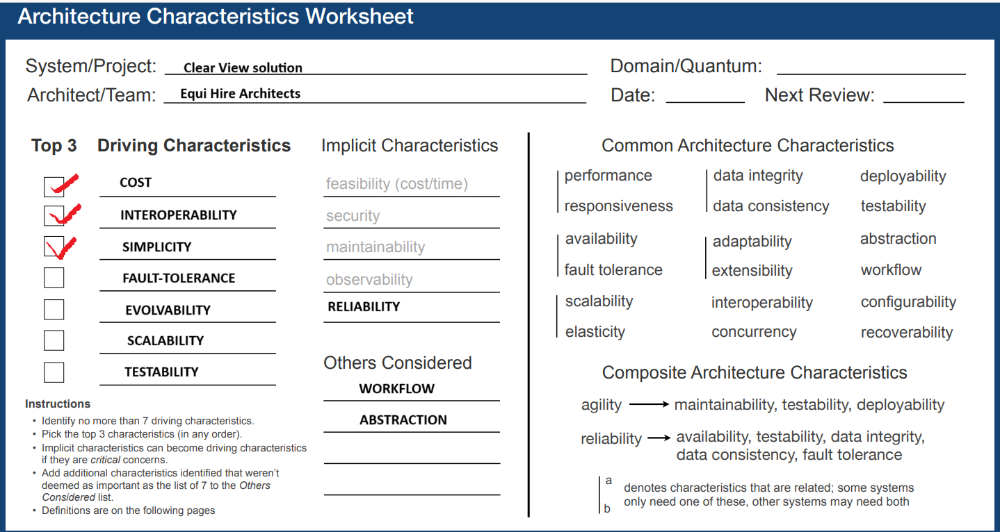

After careful consideration, we have decided that Service-Based architecture is one that best fits our requirements.

There were other styles which could be also good options like microkernel, microservices or event-driven, however, cost and simplicity were the main characteristics which made the difference.

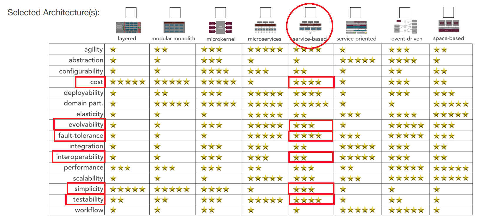


|ADR # |	Title |	Why |	Trade-offs |
|------|----------|-----|--------------|	
|01 |	Chosen architecture characteristics: cost, interoperability, simplicity, fault-tolerance, and evolvability |	Prioritized cost, interoperability, simplicity, fault-tolerance, and evolvability based on problem statement.| 	May require trade-offs between simplicity and evolvability over time, potentially limiting flexibility as requirements grow. |	
|02 |	Service-Based Architecture selected	|Service-based architecture chosen to align with prioritized characteristics (cost, fault-tolerance, scalability).| 	Increased complexity in service orchestration and operational overhead compared to a monolithic approach. This level of complexity is needed to allow enough evolvability of system. Reduced scalability compared to microservices of event-driven architecture to optimize more for cost and expected scale.|	


## Domain analysis (ER diagram and schema partitioning and ADRs listed)
## Architecture
### Top level architecture 

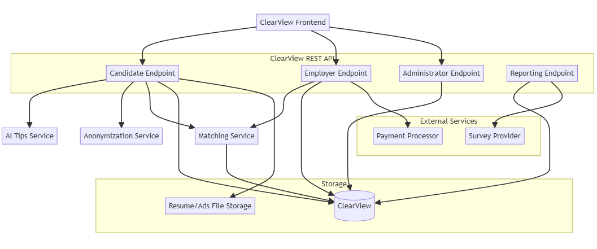

- ClearView Frontend - top layer using REST APIs which are hiding complexity of the system below.

- ClearView REST API - Top level abstraction to be used for integration with HR apps. Clear view can have its own front end hooking up to this layer.

- Candidate Endpoint - REST API component covering methods needed for Candidate flow.

- Employer Endpoint - REST API component covering methods for Employer flow.

- Administrator Endpoint - REST API component covering methods for Admin flow.

- Reporting Endpoint - REST API component covering methods needed for Monthly reporting.

- AI Tips Service - Service providing tips for the Candidate resume.

- Matching Service - Service making actual matches based on skills extracted from job ads and resumes.

- Resume/Ads File Storage - Storage used for 
files.

- ClearView database - Relational database for rest of the data.

- External services (Payment processor and Survey Provider)


#### Architecture Decision Records

Here is the list of all ADRs we made during the process to came up with architecture we designed. Full ADRs can be found through links in the table.


|ADR #| 	Title| 	Why |	Trade-offs 	|
|------|----------|-----|--------------|	
|01 |	Chosen architecture characteristics: cost, interoperability, simplicity, fault-tolerance, and evolvability |	Prioritized cost, interoperability, simplicity, fault-tolerance, and evolvability based on problem statement.| 	May require trade-offs between simplicity and evolvability over time, potentially limiting flexibility as requirements grow. |	
|02 |	Service-Based Architecture selected	|Service-based architecture chosen to align with prioritized characteristics (cost, fault-tolerance, scalability).| 	Increased complexity in service orchestration and operational overhead compared to a monolithic approach. This level of complexity is needed to allow enough evolvability of system.Reduced scalability compared to microservices of event-driven architecture to optimize more for cost and expected scale.|		
|03 |	One REST API with multiple endpoints |	Simplifies architecture by having a single API with various endpoints for different functionalities. |	Can lead to large, complex APIs over time, making it harder to maintain clear boundaries between services.Reducing number of REST API services to one instead of multiple (one for each domain).	|
|04 |	One relational database and one file-storage DB |	Simplifies maintenance by reducing the number of databases, combining multiple domains into one relational DB.| Resumes need separate file storage.	May compromise modularity and separation of concerns between domains, leading to potential scaling or data management challenges later. However big scalability is not expected so we feel comfortable in making this decision.	|
|05 |	Organize components per domain| 	Organizes ClearView components into domain-specific groups (candidate, employer, matching, etc.) to separate concerns effectively and improve maintainability and testability.|	Requires managing inter-domain communication and potentially increasing complexity if domains grow interdependent. 	|
|06 |	Split database by schema to decouple domains and improve security|	Improves fault-tolerance and security by separating candidate, employer, matching, and analytics data into schemas. |	More complex database management, requiring careful handling of schema-specific optimizations and inter-schema queries. |	
|07 |	Analytics as part of regular database| 	Simplifies architecture by embedding analytics within the regular database, avoiding real-time analytics complexity. |	May limit future analytics capabilities if real-time or advanced analytics are needed, and could add extra load to the operational database. However, it should be fairly easy to move this data to separate database if needed.|	
|08 |	Split AI tips and matching services |	Decouples AI tips and matching services, making the system simpler and easier to scale independently.  |	Requires coordination between services and careful orchestration of dependencies if they need to interact, adding complexity in integration. On the other hand we improve separation of concerns, maintaining and testability.|	
|09 	|Matching once per Job Ad deadline 	|Matches candidates once per job ad deadline, aligning with employer expectations and simplifying processing pipelines. |	Delays real-time candidate matching and feedback loops, making the system less responsive to changes in candidate or job availability during the job lifecycle. However, it dramatically reduces costs of processing. If needed, processing can be invoked through Matching API on demand.	|
|10 |	Configurable top N candidates for employers |	Allows employers to see the top N candidates, making "N" configurable, ensuring scalability and reducing DB overload. 	|Complexity in configuring "N" dynamically across jobs; potential risk if "N" is set too high or too low for specific job listings, affecting employer satisfaction.|
|11 |	Use lightweight authentication (OAuth2, Shiro) |	Implements simple and lightweight authentication to reduce complexity while securing access to services. |	May require upgrades to a more robust solution if security or user management needs increase, adding migration overhead later. 	|


### Candidate Endpoint

Subset of domain model used for Candidate Endpoints:

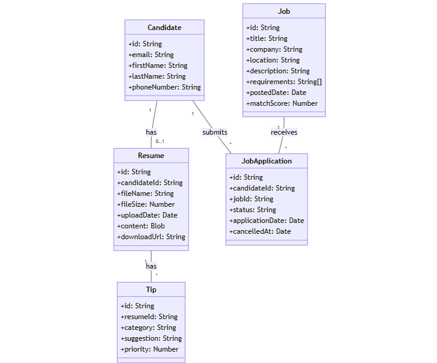

#### Account Management
Register Candidate
- POST /api/candidates/register
``` json
Request Body:
  {
    "email": "string",
    "password": "string",
    "firstName": "string",
    "lastName": "string",
    "phoneNumber": "string"
  }
```
```
Response: (201 Created)
```
``` json
  {
    "id": "string",
    "email": "string",
    "firstName": "string",
    "lastName": "string",
    "createdAt": "string (ISO 8601 date)"
  }
```

Login Candidate
- POST /api/candidates/login
``` json
Request Body:
  {
    "email": "string",
    "password": "string"
  }
```
```
Response: (200 OK)
```
``` json
  {
    "token": "string",
    "expiresIn": "number"
  }
```

Get Candidate Profile
- GET /api/candidates/profile
```
Headers:
Authorization: Bearer {token}
Response: (200 OK)
```
``` json
  {
    "id": "string",
    "email": "string",
    "firstName": "string",
    "lastName": "string",
    "phoneNumber": "string"
  }
````

Update Candidate Profile
- PUT /api/candidates/profile
```
Headers:
Authorization: Bearer {token}
Request Body:
```
``` json
  {
    "firstName": "string",
    "lastName": "string",
    "phoneNumber": "string"
  }
```

Response: (200 OK)

``` json
  {
    "id": "string",
    "email": "string",
    "firstName": "string",
    "lastName": "string",
    "phoneNumber": "string",
    "updatedAt": "string (ISO 8601 date)"
  }
```

Resume Management
Upload Resume
- POST /api/candidates/resume
```
Headers:
Authorization: Bearer {token}
Content-Type: multipart/form-data
Request Body:
- file: (binary)
Response: (201 Created)
```
``` json
  {
    "id": "string",
    "fileName": "string",
    "uploadDate": "string (ISO 8601 date)",
    "fileSize": "number"
  }
```

Get Resume
- GET /api/candidates/resume
```
Headers:
Authorization: Bearer {token}
Response: (200 OK)
```
``` json
  {
    "id": "string",
    "fileName": "string",
    "uploadDate": "string (ISO 8601 date)",
    "fileSize": "number",
    "downloadUrl": "string"
  }
```

Delete Resume
- DELETE /api/candidates/resume
```
Headers:
Authorization: Bearer {token}
Response: (200 OK)
```
``` json
  {
    "message": "Resume deleted successfully"
  }
```

AI Tips
Get Resume Tips
- GET /api/candidates/resume/tips
```
Headers:
Authorization: Bearer {token}
Response: (200 OK)
```
``` json
  {
    "resumeId": "string",
    "tips": [
      {
        "category": "string",
        "suggestion": "string",
        "priority": "number"
      }
    ],
    "overallScore": "number"
  }
```

Job Matching
Get Job Matches
- GET /api/candidates/jobs/matches
```
Headers:
Authorization: Bearer {token}
Query Parameters:
page: number
limit: number
Response: (200 OK)
```
``` json
  {
    "totalMatches": "number",
    "page": "number",
    "limit": "number",
    "matches": [
      {
        "jobId": "string",
        "title": "string",
        "company": "string",
        "location": "string",
        "matchScore": "number",
        "postedDate": "string (ISO 8601 date)"
      }
    ]
  }
```

Retrieve filtered matches
- GET /api/candidates/jobs/matches/filter
```
Headers:
Authorization: Bearer {token}
Query Parameters:
title: string (optional)
company: string (optional)
location: string (optional)
minMatchScore: number (optional)
maxMatchScore: number (optional)
fromDate: string (ISO 8601 date, optional)
toDate: string (ISO 8601 date, optional)
page: number (default: 1)
limit: number (default: 20)
Response: (200 OK)
```
``` json
  {
    "totalMatches": "number",
    "page": "number",
    "limit": "number",
    "matches": [
      {
        "jobId": "string",
        "title": "string",
        "company": "string",
        "location": "string",
        "matchScore": "number",
        "postedDate": "string (ISO 8601 date)"
      }
    ],
    "appliedFilters": {
      "title": "string",
      "company": "string",
      "location": "string",
      "minMatchScore": "number",
      "maxMatchScore": "number",
      "fromDate": "string (ISO 8601 date)",
      "toDate": "string (ISO 8601 date)"
    }
  }
```

Get Job Details
- GET /api/candidates/jobs/{jobId}
```
Headers:
Authorization: Bearer {token}
Path Parameters:
jobId: string
Response: (200 OK)
```
``` json
  {
    "id": "string",
    "title": "string",
    "company": "string",
    "location": "string",
    "description": "string",
    "requirements": ["string"],
    "postedDate": "string (ISO 8601 date)",
    "matchScore": "number"
  }
```

Job Applications
Apply for Job
- POST /api/candidates/jobs/{jobId}/apply
``` 
Headers:
Authorization: Bearer {token}
Path Parameters:
jobId: string
Response: (201 Created)
```

``` json
  {
    "applicationId": "string",
    "jobId": "string",
    "applicationDate": "string (ISO 8601 date)",
    "status": "string"
  }
```

### Employer Endpoint

#### 1. Overview
The Employer and Payment module needs to integrate seamlessly within the ClearView platform, focusing on:
Employer registration and role management.
Uploading job ads and managing candidate selection.
Processing payments for accessing candidate profiles and services.
Enabling HR systems integration for better job ad synchronization.
Tracking employer activity, including interviews and candidate progression.
This solution will involve a set of REST API CRUD operations, a payment gateway integration, and the necessary database structure to manage the employer's data, payment records, and job posting history.

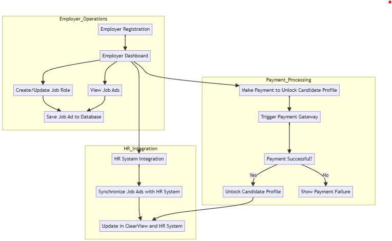

#### 2. Employer Registration and Management
The Employer system will handle the following:
Employer Registration:
New employers will register using the platform.
On successful registration, the system will autofill company details using external services (e.g., company data APIs).
Employers can manage their profiles and hiring roles.
Employer Dashboard:
Employers will have a dashboard where they can view job postings, select candidates, and monitor payments.
Employer Job Ad Management:
Employers will create, update, or delete job ads through the system.
The AI system will use job ads to match with candidate profiles, ensuring anonymization and alignment with S.M.A.R.T. goals.
#### 3. Payment Processing
The Payment System will be a critical part of ClearView to ensure employers pay for services and unlock candidate profiles.
- Payment Triggers:
Employers can browse anonymized candidates, but to unlock full profiles and contact information, they need to make a payment.
Payments will also be triggered for accessing advanced services, like AI tips or DEI consultant services.
- Payment Gateway Integration:
The platform will integrate with third-party payment gateways (e.g., Stripe, PayPal).
All payment transactions will be securely stored, and receipts will be issued via email.
- Subscription Plans:
Employers can subscribe to monthly plans, giving them access to a specific number of candidate profiles or advanced services.
Plan management (viewing/upgrading/downgrading subscriptions) will be available through the employer's dashboard.
#### 4. HR System Integration
To streamline hiring processes, the ClearView platform will support integration with HR systems like Workday, Greenhouse, etc. This will allow:
- Synchronization of Job Ads:
Job Ads posted in ClearView will be synchronized with the HR systems.
Any changes made to job ads in HR systems will automatically reflect on ClearView, reducing redundancy.
- Candidate Selection Integration:
Selected candidates within ClearView will be automatically updated in the employer’s HR system for further progression in the hiring pipeline.
This integration will also allow the HR system to pull anonymized feedback from ClearView, allowing employers to keep track of hiring metrics across both platforms.
#### 5. REST API CRUD Operations
The API will enable the following operations:
- Employer:
```
POST /employer: Register a new employer and autofill company details.
GET /employer/{id}: Retrieve employer details, including job ads and payment history.
PUT /employer/{id}: Update employer information.
DELETE /employer/{id}: Deactivate employer profile.
GET /employer/{employer_id}/candidates/{candidate_id}/resume: Download unlocked candidate resume.
```
- Job Ads:
```
POST /employer/{id}/job: Create a new job ad.
GET /employer/{id}/jobs: Retrieve all job ads for an employer.
PUT /employer/{id}/job/{job_id}: Update a job ad.
DELETE /employer/{id}/job/{job_id}: Remove a job ad.

```
- Payments:

```
POST /employer/{id}/payment: Make a payment to unlock candidate profiles or services.
GET /employer/{id}/payments: Retrieve payment history for an employer.
```

- HR System Integration:
```
POST /employer/{id}/hr-integration: Integrate ClearView with an HR system.
GET /employer/{id}/hr-sync: Synchronize job ads with HR system.
```
### Administrator Endpoint

#### Administrator Endpoint Overview
The Administrator Endpoint is designed to provide system administrators with special privileges for managing users, candidates, employers, and the skill-matching configuration. This includes the ability to update hire statuses, modify user data, and change the matching strategy (e.g., switch between Cosine Similarity and LLM-based matching).

##### Administrator Endpoint Methods

**updateCandidateHireStatus:**

Description: Allows an administrator to update the hire status of a candidate.

Parameters:
```
candidateId: The ID of the candidate.
jobAdId: The ID of the job the candidate applied to.
status: The new hire status (`hired`, rejected, pending).
```
Response: 
```json 
{success: true, message: "Candidate hire status updated"}
 ```

Example Usage:
``` json
   PUT /api/admin/updateCandidateHireStatus
   Body:
   {
     "candidateId": "123",
     "jobAdId": "456",
     "status": "hired"
   }
```

**updateUser**

Description: Allows an administrator to update general user data, including for candidates and employers.

Parameters:
```
userId: The ID of the user.
data: A JSON object containing the updated user data (e.g., name, email, etc.).
```
Response: 
``` json
{success: true, message: "User data updated"}
```

Example Usage:

``` json
   PUT /api/admin/updateUser
   Body:
   {
     "userId": "789",
     "data": {
       "email": "newemail@example.com",
       "name": "Updated Name"
     }
   }
```

**updateCandidate**

Description: Allows an administrator to update specific candidate-related data (e.g., skills, resume).

Parameters:
```
candidateId: The ID of the candidate.
data: A JSON object containing the updated candidate data (e.g., skills, resume, etc.).
```
Response: 
``` json
{success: true, message: "Candidate data updated"}
```

Example Usage:
``` json
   PUT /api/admin/updateCandidate
   Body:
   {
     "candidateId": "123",
     "data": {
       "skills": ["Java", "Python"],
       "resume": "updatedResumeData"
     }
   }
```

**updateEmployer**

Description: Allows an administrator to update 
employer-related data (e.g., company details, job posts).

Parameters:
```
employerId: The ID of the employer.
data: A JSON object containing the updated employer data (e.g., company name, job postings, etc.).
```
Response: 
``` json
{success: true, message: "Employer data updated"}
```

Example Usage:

``` json
   PUT /api/admin/updateEmployer
   Body:
   {
     "employerId": "456",
     "data": {
       "companyName": "New Company Name",
       "jobPosts": ["789", "101"]
     }
   }
```

**updateMatchingStrategyConfig**

Description: Allows an administrator to update the matching strategy configuration for the skill-matching service (Cosine Similarity vs. LLM).

Parameters:
```
strategy: The new matching strategy (`cosineSimilarity` or LLM).
```
Response: 
``` json
{success: true, message: "Matching strategy updated"}
```

Example Usage:
``` json
   PUT /api/admin/updateMatchingStrategyConfig
   Body:
   {
     "strategy": "cosineSimilarity"
   }
```
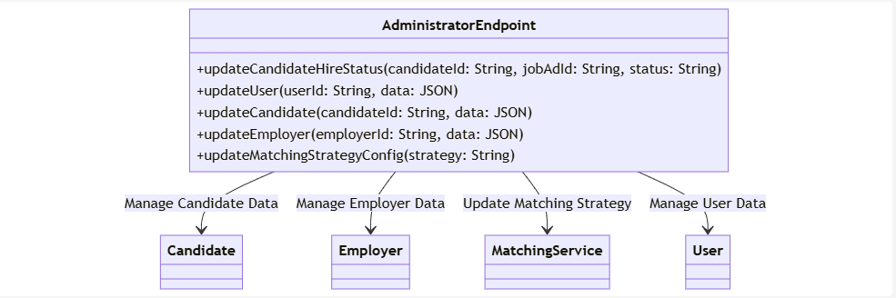

How It Works:

**AdministratorEndpoint:** A centralized API that provides special privileges to system administrators. Each method manages a different aspect of the system:
- **Candidate:** Admins can update candidate-specific data (skills, resumes) and hire statuses.
- **Employer:** Admins can modify employer-related data (company details, job posts).
- **MatchingService:** Admins can change the skill-matching strategy (e.g., switch between Cosine Similarity and LLM).
- **User:** Admins can update general user data for both candidates and employers.

### AI Tips service

Tips are generated based on uploaded resume, with a goal to improve quality of it and help candidate in finding a job.
This will be achieved through improvements in:
- Quantifying results
- Performance focus evaluation
- Skill Level Estimation - this will also help our skill extraction system
- Language Enhancement and Clarification**
- Formatting Suggestions
and many others

Flow diagram:


Sequence diagram:

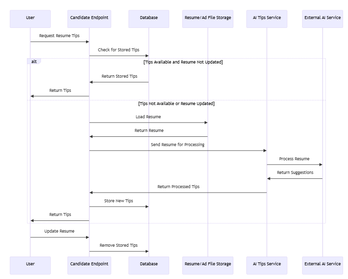

**Analysis of LLM Usage for AI-Tips**

**Pros:**

- Advanced language understanding: LLMs can comprehend complex resume structures and extract relevant information accurately.
- Contextual awareness: LLMs can provide suggestions based on industry standards, job market trends, and best practices in resume writing.
- Flexibility: LLMs can adapt to various resume formats and styles without requiring specific templates.
- Continuous improvement: As LLMs are updated, the quality of suggestions can improve without significant changes to the system architecture.
- Multilingual support: LLMs can potentially provide tips for resumes in multiple languages.

**Cons:**
- Computational cost: Processing resumes through LLMs can be resource-intensive and potentially expensive, especially for large volumes of requests.
- Latency: The time required to generate suggestions using LLMs might be higher compared to rule-based systems, potentially affecting user experience.
- Inconsistency: LLMs may sometimes produce inconsistent or irrelevant suggestions, requiring additional validation or filtering mechanisms.

**Related ADRs**

|ADR #| 	Title| 	Why |	Trade-offs 	|
|------|----------|-----|--------------|
|08 |	Split AI tips and matching services |	Decouples AI tips and matching services, making the system simpler and easier to scale independently.  |	Requires coordination between services and careful orchestration of dependencies if they need to interact, adding complexity in integration. On the other hand we improve separation of concerns, maintaining and testability.|	

### Matching service

The Matching Service in ClearView is designed to process candidate resumes and job advertisements to extract skills and match them, providing a score that indicates the suitability of a candidate for a job. The service is built with flexibility in mind, using **Cosine Similarity** as the default matching algorithm, but allowing for other strategies such as **LLM-based matching** if needed.

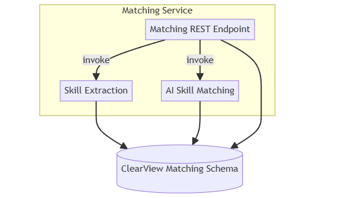

**Matching REST Endpoint:** The main entry point to the Matching Service. It provides methods to:
```
extractJobSkills(jobAdId)

extractCandidateSkills(candidateId)

getAllMatchingData(jobAdId)

getMatchingData(candidateId, jobAdId)
```
**Skill Extraction:** This component takes resumes and job descriptions and extracts skills from them. These skills are stored in the ClearView database for future use in matching.

**AI Skill Matching:** This component compares candidate skills with job ad skills using Cosine Similarity as the default algorithm. The system calculates a matching score (1-100%) based on the similarity of the skills.

#### Triggering
Matching is done per job advertisement once it is closed to optimize cost. It could be also triggered on demand if business needs are such. We want to avoid multiple passes and redundant processes this way. 

#### Matching Process

Matching is done for a job in a loop for all candidates . Process for single candidate is depicted on flowchart below.

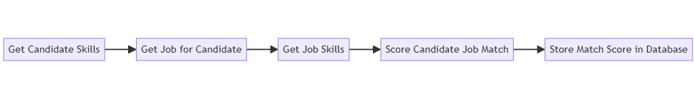

- Get Candidate Skills: Fetch the extracted skills for a candidate based on their CandidateId. Output is a map of skills.
Example:
``` {Java: Expert, Python: Intermediate}```

- Get Job for Candidate: Retrieve the list of jobs that the candidate applied to. The job data includes the job requirements and expected skills.
- Get Job Skills: Extract the required skills for the job from the JobAdId. Output is a map of skills.
Example: ```{Java: Expert, SQL: Intermediate}```

- Score Candidate Job Match: Compare the candidate’s skills with the job’s required skills. Use Cosine Similarity to compute a score (1-100%) that represents the candidate’s fit for the job.
- Store Matching Score: Save the calculated score in the database, linking the CandidateId, JobAdId, and the score.
Example: ```{CandidateId: 123, JobAdId: 456, Score: 85} ```

#### Skill Extraction

Skill extraction is triggered before matching to gather required skills from job add and candidate skills from resume.
Extraction needs to be done using AI model, in our case LLM which transforms resume or add into map of skill descriptions.

Example :
``` json
{ 
    "Java": "Expert", 
    "SQL": "Intermediate", 
}
```

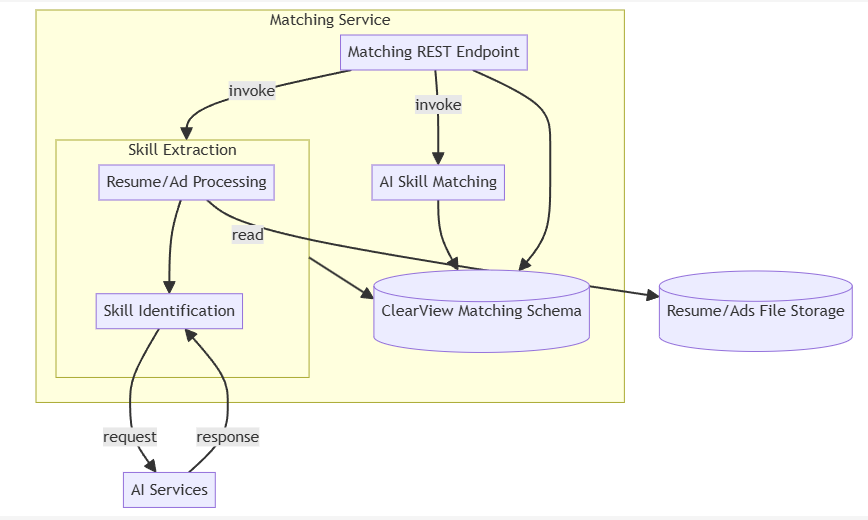

Class diagram

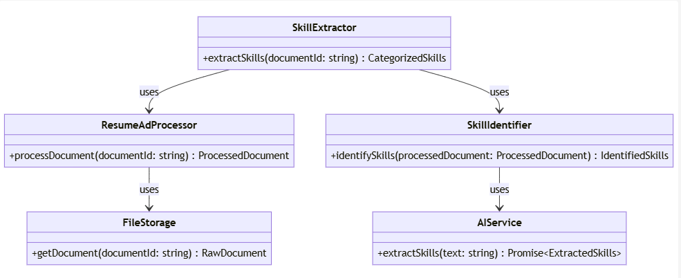


#### Scoring Logic
Scoring candidates against job ads is a complex task, with many potential approaches. Given ClearView’s emphasis on cost-efficiency, we favor solutions that are cost-effective while providing the flexibility to adopt different strategies.

**Cosine Similarity:**

Advantages:
- Low cost to run and implement.
- Predictable and reliable with consistent performance.
- Provides good latency and scalability for real-time processing.

Disadvantages:
- Limited understanding of nuanced relationships between skills.

**LLM Similarity:**

Advantages:
- Can capture more complex relationships between skills and job requirements (e.g., inferred skills, context).
Disadvantages:
- Expensive to run and can introduce latency.
- May “hallucinate” results and lack reliability in some cases.

Decision:

For the initial implementation, **Cosine Similarity** will be used due to its cost-efficiency and predictability. However, the system will be designed to support alternative matching strategies such as **LLM-based matching**. This flexibility will allow us to switch or enhance the matching logic as the system evolves.

Here is a class diagram representing the Scoring Logic using the Strategy Pattern for implementing both LLM Strategy and Cosine Similarity Strategy.

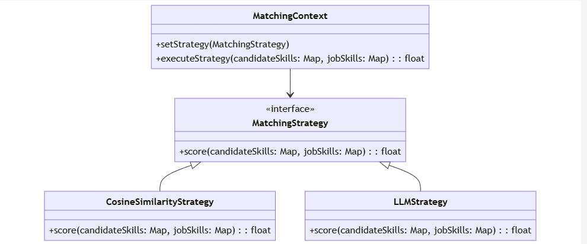

Explanation:

- MatchingContext: This class represents the context in which different matching strategies (Cosine Similarity or LLM) can be applied. It has:
    - A method ```setStrategy(MatchingStrategy)``` to set the desired strategy (either Cosine Similarity or LLM).
    - A method ```executeStrategy(candidateSkills, jobSkills)``` to invoke the strategy's scoring logic with the candidate's skills and the job's required skills.
- MatchingStrategy: This is an interface that defines the common method ```score(candidateSkills, jobSkills)```, which both strategies must implement. 
- CosineSimilarityStrategy: Implements the ```MatchingStrategy``` interface, providing a specific implementation of ```score()``` using Cosine Similarity to compare the candidate's skills and the job's required skills.
- LLMStrategy: Also implements the ```MatchingStrategy``` interface, but the ```score()``` method uses LLM-based logic to match the skills.

**Potential Improvement - Hybrid Matching: Cosine + LLM**

In case we figure out that Cosine Similarity is not producing good enough results, but we cannot switch directly to LLM because it would be to costly to run LLM over entire database, we could do hybrid solution. Idea is to filter out first set of candidates using Cosine Similarity and then use fine grained matching using LLM on top X matches. This way we would reduce costs but still have higher quality matches.

Process is depicted in the flowchart below.


### Database
### ER diagram
### Schema considerations
### File Storage
### External services
### Payment processor
ADR and decision
### Survey
ADR and decision
### Additional considerations
#### Evolvability
#### Scalability
#### Business model (Premium)
....
### Appendix (additional materials, investigated options etc.)

