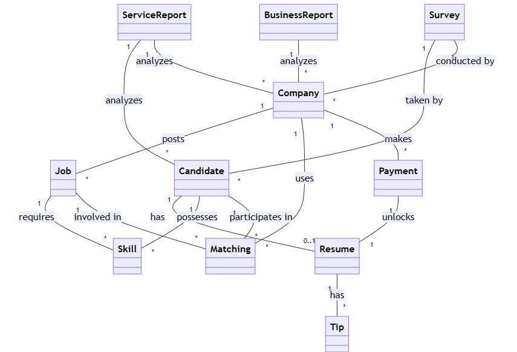
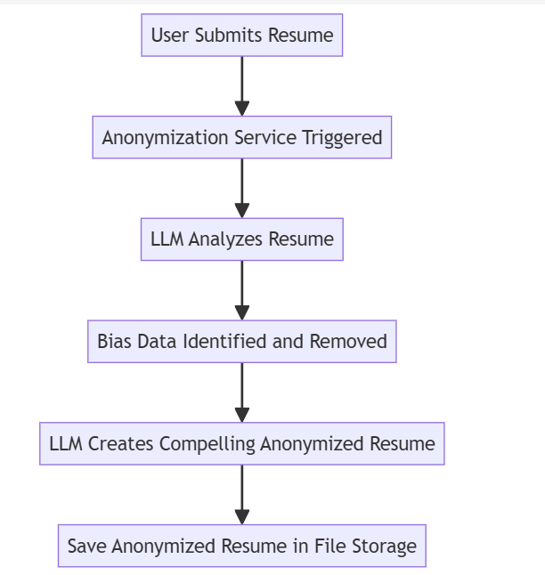
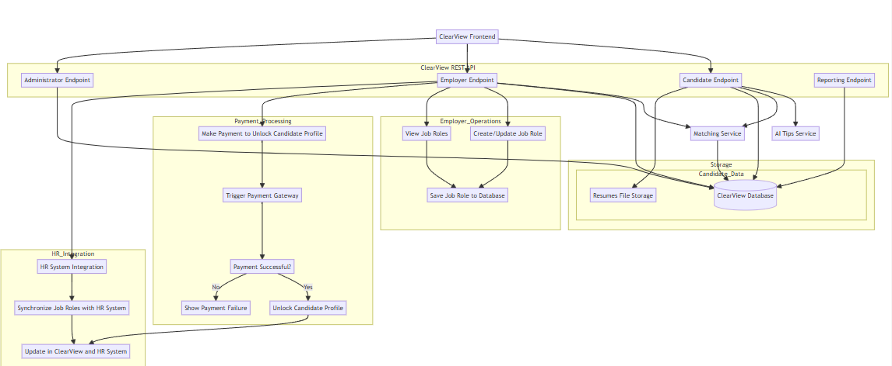
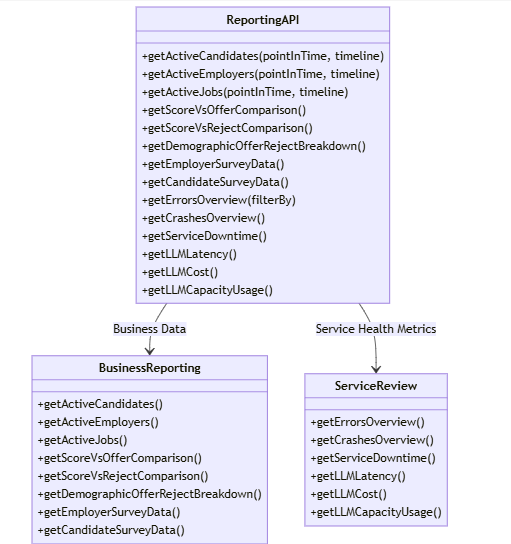
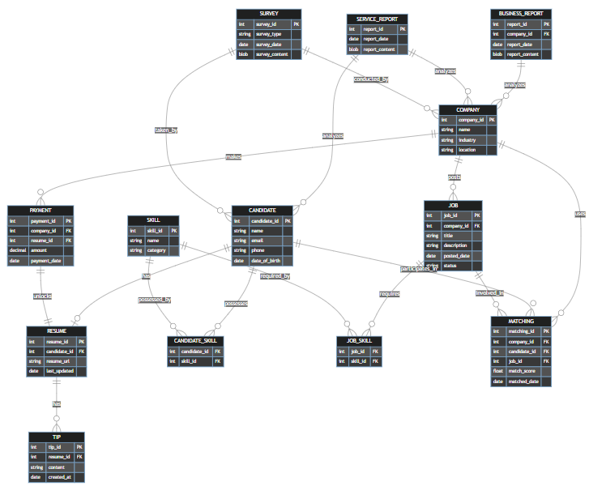

# Clear View Solution
 
## Equi Hire Architects Team

We are a team of software engineers from Microsoft Serbia very passionate about software architecture. We have been practicing architectural katas inside our team inspired by books and videos from Neal Ford and Mark Richards. This time we decided to challenge ourselves and participate in official event.

- [Uros Milivojevic](https://www.linkedin.com/in/urosmilivojevic/)
- [Marjan Slavkovski](https://www.linkedin.com/in/marjan-s/)
- [Rastko Djordjevic](https://www.linkedin.com/in/rastko-djordjevic/)
- [Goran Zoranovic](https://www.linkedin.com/in/goranzoranovic/)

## Table of contents
- [Company overview](#company-overview)
- [Requirements](#requirements)
- [Identifying architecture characteristics](#identifying-architecture-characteristics)
- [Domain analysis](#domain-analysis)
- [Architecture](#architecture)
    - [Top level architecture](#top-level-architecture)
    - [Architecture Decision Records](#architecture-decision-records)
- [AI Backend](#ai-backend)
    - [AI Tips Service](#ai-tips-service)
    - [Anonymization Service](#anonymization-service)
    - [Matching Service](#matching-service)
- [Integration](#integration)
- [REST API](#rest-api)
    - [Candidate Endpoint](#candidate-endpoint)
    - [Employer Endpoint](#employer-endpoint)
    - [Administrator Endpoint](#administrator-endpoint)
    - [Reporting Endpoint](#reporting-endpoint)
        - [Triggering data aggregation](#triggering-data-aggregation)
- [Storage](#storage)
   - [Database](#database)
   - [Schema considerations](#schema-considerations)
   - [File Storage](#file-storage)
- [External services](#external-services)
- [Additional considerations](#additional-considerations)
   - [Evolvability](#evolvability)
   - [Scalability](#scalability)
   - [Premium Business Model](#premium-business-model)

## Company overview

Diversity Cyber Council (https://www.diversitycybercouncil.com/) is a 501c3 Non-Profit that serves under-represented demographics in the tech industry by facilitating education, training, and staffing opportunities to establish a sustainable and diverse talent pipeline to the workforce.

## Requirements 

High level requirements are listed in this document:
[Requirements](https://docs.google.com/document/d/1jCHMAvgzqaYaAp09br12OC4ozpVXZR3s9ezgEqncZ9U/edit#heading=h.jsoimuz95gvo)

Additionally, through communication with stakeholders we found few other requirements:

- Cost is important aspect and we should aim to reduce it.
- Big volumes of users are not expected so scalability is not very important.
- There is a possibility of potential adding new AI features in the future, but it is not hard requirement.
- System will be maintained by current Diversity Cyber Council IT team

## Identifying architecture characteristics 

Taking into account all requirements we decided that 3 main characteristics for our solution should be: **Cost, Interoperability and Simplicity.**

Besides these we consider *Fault-tolerance, Evolvabilty, Scalability, Testability, Workflow and Abstraction.*

*Reliablity* is also important as one of composite characteristis.


After careful consideration, we have decided that Service-Based architecture is one that best fits our requirements.

There were other styles which could be also good options like microkernel, microservices or event-driven, however, cost and simplicity were the main characteristics which made the difference.


|ADR #| 	Title| 	Why |	Trade-offs 	| Link |
|------|----------|-----|--------------|-----|	
|01 |	Chosen architecture characteristics: cost, interoperability, simplicity, fault-tolerance, and evolvability |	Prioritized cost, interoperability, simplicity, fault-tolerance, and evolvability based on problem statement.| 	May require trade-offs between simplicity and evolvability over time, potentially limiting flexibility as requirements grow. |	<a href="adr/adr01.md">ADR01</a>|
|02 |	Service-Based Architecture selected	|Service-based architecture chosen to align with prioritized characteristics (cost, fault-tolerance, scalability).| 	Increased complexity in service orchestration and operational overhead compared to a monolithic approach. This level of complexity is needed to allow enough evolvability of system.Reduced scalability compared to microservices of event-driven architecture to optimize more for cost and expected scale.| <a href="adr/adr02.md">ADR02</a>|


## Domain analysis
Before we defined components of the architecture we took a look at domain model to identify key domains which would help us in better organizing components and services in architecture.



We landed on next domains:
- **Candidate** : Covering flow related to candidate: creating profile, uploading and iterating on resume, overview of matches.
- **Employer** : Covering flow related to employer: creating profile, job, overview of matches, payment and download of full resumes.
- **AI Backend** : Covers the AI part of the architecture: Anonymization, AI Tips and Matching service.
- **Reporting**: Covering everything related to reports.
- **Survey**: Surveys for Candidate and Employer.
- **Administrator** : Admin flow covered.

|ADR #| 	Title| 	Why |	Trade-offs 	| Link |
|------|----------|-----|--------------|-------|	
|03 |	Organize components per domain| 	Organizes ClearView components into domain-specific groups (candidate, employer, AI backend, etc.) to separate concerns effectively and improve maintainability and testability.|	Requires managing inter-domain communication and potentially increasing complexity if domains grow interdependent. 	| <a href="adr/adr03.md">ADR03</a>|


## Architecture
### Top level architecture 


- ClearView Frontend - top layer using REST APIs which are hiding complexity of the system below.

- ClearView REST API - Top level abstraction to be used for integration with HR apps. Clear view can have its own front end hooking up to this layer.

- Candidate Endpoint - REST API component covering methods needed for Candidate flow.

- Employer Endpoint - REST API component covering methods for Employer flow.

- Administrator Endpoint - REST API component covering methods for Admin flow.

- Reporting Endpoint - REST API component covering methods needed for Monthly reporting.

- Anonymization Service - Service which is creating anonymized version of resume.

- AI Tips Service - Service providing tips for the Candidate resume.

- Matching Service - Service making actual matches based on skills extracted from job ads and resumes.

- Resume/Ads File Storage - Storage used for 
files.

- ClearView database - Relational database for rest of the data.

- External services (Payment processor and Survey Provider)


### Architecture Decision Records

Here is the condensed list of all ADRs we made during the process to came up with architecture we designed. Full ADRs can be found through links in the table.


|ADR #| 	Title| 	Why |	Trade-offs 	| Link |
|------|----------|-----|--------------|-----|	
|01 |	Chosen architecture characteristics: cost, interoperability, simplicity, fault-tolerance, and evolvability |	Prioritized cost, interoperability, simplicity, fault-tolerance, and evolvability based on problem statement.| 	May require trade-offs between simplicity and evolvability over time, potentially limiting flexibility as requirements grow. |	<a href="adr/adr01.md">ADR01</a>|
|02 |	Service-Based Architecture selected	|Service-based architecture chosen to align with prioritized characteristics (cost, fault-tolerance, scalability).| 	Increased complexity in service orchestration and operational overhead compared to a monolithic approach. This level of complexity is needed to allow enough evolvability of system.Reduced scalability compared to microservices of event-driven architecture to optimize more for cost and expected scale.| <a href="adr/adr02.md">ADR02</a>|
|03 |	Organize components per domain| 	Organizes ClearView components into domain-specific groups (candidate, employer, matching, etc.) to separate concerns effectively and improve maintainability and testability.|	Requires managing inter-domain communication and potentially increasing complexity if domains grow interdependent. 	|	<a href="adr/adr03.md">ADR03</a>|
|04 |	One REST API with multiple endpoints |	Simplifies architecture by having a single API with various endpoints for different functionalities. |	Can lead to large, complex APIs over time, making it harder to maintain clear boundaries between services.Reducing number of REST API services to one instead of multiple (one for each domain).	|<a href="adr/adr04.md">ADR04</a>|
|05 |	One relational database and one file-storage DB |	Simplifies maintenance by reducing the number of databases, combining multiple domains into one relational DB.| Resumes need separate file storage.	May compromise modularity and separation of concerns between domains, leading to potential scaling or data management challenges later. However big scalability is not expected so we feel comfortable in making this decision.	|<a href="adr/adr05.md">ADR05</a>|
|06 |	Split database by schema to decouple domains and improve security|	Improves fault-tolerance and security by separating candidate, employer, matching, and analytics data into schemas. |	More complex database management, requiring careful handling of schema-specific optimizations and inter-schema queries. |	<a href="adr/adr06.md">ADR06</a>|
|07 |	Analytics as part of regular database| 	Simplifies architecture by embedding analytics within the regular database, avoiding real-time analytics complexity. |	May limit future analytics capabilities if real-time or advanced analytics are needed, and could add extra load to the operational database. However, it should be fairly easy to move this data to separate database if needed.|	<a href="adr/adr07.md">ADR07</a>|
|08 |	Split Anonymization, AI tips and matching services |	Decouples Anonymization, AI tips and matching services, making the system simpler and easier to scale independently.  |	Requires coordination between services and careful orchestration of dependencies if they need to interact, adding complexity in integration. On the other hand we improve separation of concerns, maintaining and testability.|	<a href="adr/adr08.md">ADR08</a>|
|09 	|Matching once per Job Ad deadline 	|Matches candidates once per job ad deadline, aligning with employer expectations and simplifying processing pipelines. |	Delays real-time candidate matching and feedback loops, making the system less responsive to changes in candidate or job availability during the job lifecycle. However, it dramatically reduces costs of processing. If needed, processing can be invoked through Matching API on demand.	|<a href="adr/adr09.md">ADR09</a>|
|10 |	Configurable top N candidates for employers |	Allows employers to see the top N candidates, making "N" configurable, ensuring scalability and reducing DB overload. 	|Complexity in configuring "N" dynamically across jobs; potential risk if "N" is set too high or too low for specific job listings, affecting employer satisfaction.|<a href="adr/adr10.md">ADR10</a>|
|11 |	Use lightweight authentication (OAuth2, Shiro) |	Implements simple and lightweight authentication to reduce complexity while securing access to services. |	May require upgrades to a more robust solution if security or user management needs increase, adding migration overhead later. 	|<a href="adr/adr11.md">ADR11</a>|
| 12 | Use Third party solution for Survey and Payment | There are good existing solutions for this problem so we can reuse and reduce costs. | Hard to customize and extend, but no maintenance and cost is low. |<a href="adr/adr12.md">ADR12</a>|
| 13  | Use Cosine Similarity for Initial Matching  | Cost-efficient and predictable for initial implementation, with flexibility for future LLM integration.        | Limited contextual understanding and potential costs when switching to LLM-based models in the future. |<a href="adr/adr13.md">ADR13</a>|

## AI Backend

### AI Tips service

Tips are generated based on uploaded resume, with a goal to improve quality of it and help candidate in finding a job.
This will be achieved through improvements in:
- Quantifying results
- Performance focus evaluation
- Skill Level Estimation - this will also help our skill extraction system
- Language Enhancement and Clarification**
- Formatting Suggestions
and many others

Flow diagram:


Sequence diagram:


**Analysis of LLM Usage for AI-Tips**

**Pros:**

- Advanced language understanding: LLMs can comprehend complex resume structures and extract relevant information accurately.
- Contextual awareness: LLMs can provide suggestions based on industry standards, job market trends, and best practices in resume writing.
- Flexibility: LLMs can adapt to various resume formats and styles without requiring specific templates.
- Continuous improvement: As LLMs are updated, the quality of suggestions can improve without significant changes to the system architecture.
- Multilingual support: LLMs can potentially provide tips for resumes in multiple languages.

**Cons:**
- Computational cost: Processing resumes through LLMs can be resource-intensive and potentially expensive, especially for large volumes of requests.
- Latency: The time required to generate suggestions using LLMs might be higher compared to rule-based systems, potentially affecting user experience.
- Inconsistency: LLMs may sometimes produce inconsistent or irrelevant suggestions, requiring additional validation or filtering mechanisms.

**Related ADRs**

|ADR #| 	Title| 	Why |	Trade-offs 	| Link |
|------|----------|-----|--------------|------|
|08 |	Split Anonymization, AI tips and matching services |	Decouples Anonymization, AI tips and matching services, making the system simpler and easier to scale independently.  |	Requires coordination between services and careful orchestration of dependencies if they need to interact, adding complexity in integration. On the other hand we improve separation of concerns, maintaining and testability.|	<a href="adr/adr08.md">ADR08</a>|

### Anonymization Service

One of the core features of ClearView is its ability to **reduce bias** in the hiring process through the **anonymization of candidate resumes**. This feature ensures that employers focus on the skills and qualifications of candidates rather than on potentially bias-inducing personal information such as names, contact details, gender, or other identifiable attributes. The **Anonymization Service**, powered by **Large Language Models (LLMs)**, is a critical component in achieving this goal, enabling a fairer and more inclusive recruitment process.

#### How the Anonymization Process Works

1. **Candidate Submission**  
   When a candidate submits their resume to ClearView, the resume typically contains personal and professional information, such as their full name, contact details, education, and work experience. This raw resume, while informative, carries the risk of introducing unconscious bias into the hiring process. 

2. **Anonymization Service Powered by LLMs**  
   Upon receiving the resume, ClearView’s **Anonymization Service** is automatically triggered. The service, utilizing **Large Language Models (LLMs)**, intelligently analyzes the resume to detect and anonymize sensitive personal information. These advanced models allow the system to:
   - Identify personal identifiers such as **names**, **contact details**, **gender**, **date of birth**, and **photographs**, even if presented in varied formats or contexts.
   - Maintain the **semantic integrity** of the resume, ensuring that anonymized resumes still convey the full scope of a candidate’s professional experience and skills.
   
   The LLM’s ability to understand context ensures that the anonymization process is thorough and adaptable, handling diverse resume formats and terminology with ease. While the LLM removes personal details, it preserves critical information such as **work experience**, **skills**, **education**, and **certifications**, ensuring that the anonymized resume remains informative.

3. **Compelling Anonymized Resume Creation**  
   The use of LLMs not only allows for effective anonymization but also enables the creation of a **compelling, professionally formatted anonymized resume**. The LLM enhances the presentation of the anonymized content by:
   - **Reformatting** the candidate’s experience and skills to emphasize qualifications that are most relevant to the job posting.
   - Ensuring a **consistent and polished presentation** across all anonymized resumes, so employers receive standardized resumes that focus solely on the candidates' qualifications.
   - Adapting the text to maintain the **flow and coherence** of the resume, even after personal information has been removed, ensuring that it is easy for employers to read and evaluate.

4. **Integration with Matching Data**  
   After the anonymization process is complete, the resume is presented to employers alongside the **matching data** generated by ClearView’s skill-matching service. This includes a match score based on the candidate’s qualifications and how well they align with the job’s requirements. Employers, therefore, see only anonymized resumes and objective data, enabling them to make informed decisions without bias.

#### Importance of LLM-Based Anonymization in Reducing Bias

Using **LLM-powered anonymization** significantly enhances ClearView’s ability to reduce bias by:
- **Contextual Understanding**: LLMs are capable of understanding the context in which personal details are presented, ensuring that all identifiable information is accurately removed while retaining important professional details.
- **Eliminating Bias**: By stripping away personal identifiers, ClearView ensures that employers focus on **what matters most**—the candidate’s skills, qualifications, and experience—without being influenced by irrelevant details like name, gender, or ethnicity.
- **Consistency Across Resumes**: LLMs enable the creation of **standardized anonymized resumes**, giving all candidates an equal opportunity to present themselves in the best possible light without the risk of bias creeping into the review process.




#### Conclusion

In ClearView, the **Anonymization Service**, powered by **LLMs**, plays a pivotal role in ensuring **fair and unbiased hiring practices**. By utilizing the capabilities of Large Language Models to intelligently anonymize resumes and generate a consistent, professional presentation, ClearView enables employers to make objective, data-driven decisions. The combination of LLM-powered anonymization and skill-matching data ensures that every candidate is evaluated based on their qualifications alone, fostering a more diverse and inclusive recruitment process.


### Matching service

The Matching Service in ClearView is designed to process candidate resumes and job advertisements to extract skills and match them, providing a score that indicates the suitability of a candidate for a job. The service is built with flexibility in mind, using **Cosine Similarity** as the default matching algorithm, but allowing for other strategies such as **LLM-based matching** if needed.


**Matching REST Endpoint:** The main entry point to the Matching Service. It provides methods to:
```
extractJobSkills(jobAdId)

extractCandidateSkills(candidateId)

getAllMatchingData(jobAdId)

getMatchingData(candidateId, jobAdId)
```
**Skill Extraction:** This component takes resumes and job descriptions and extracts skills from them. These skills are stored in the ClearView database for future use in matching.

**AI Skill Matching:** This component compares candidate skills with job ad skills using Cosine Similarity as the default algorithm. The system calculates a matching score (1-100%) based on the similarity of the skills.

#### Triggering
Matching is done per job advertisement once it is closed to optimize cost. It could be also triggered on demand if business needs are such. We want to avoid multiple passes and redundant processes this way. 

|ADR #| 	Title| 	Why |	Trade-offs 	| Link |
|------|----------|-----|--------------|------|
|09 	|Matching once per Job Ad deadline 	|Matches candidates once per job ad deadline, aligning with employer expectations and simplifying processing pipelines. |	Delays real-time candidate matching and feedback loops, making the system less responsive to changes in candidate or job availability during the job lifecycle. However, it dramatically reduces costs of processing. If needed, processing can be invoked through Matching API on demand.	|<a href="adr/adr09.md">ADR09</a>|

#### Matching Process

Matching is done for a job in a loop for all candidates . Process for single candidate is depicted on flowchart below.


- Get Candidate Skills: Fetch the extracted skills for a candidate based on their CandidateId. Output is a map of skills.
Example:
``` {Java: Expert, Python: Intermediate}```

- Get Job for Candidate: Retrieve the list of jobs that the candidate applied to. The job data includes the job requirements and expected skills.
- Get Job Skills: Extract the required skills for the job from the JobAdId. Output is a map of skills.
Example: ```{Java: Expert, SQL: Intermediate}```

- Score Candidate Job Match: Compare the candidate’s skills with the job’s required skills. Use Cosine Similarity to compute a score (1-100%) that represents the candidate’s fit for the job.
- Store Matching Score: Save the calculated score in the database, linking the CandidateId, JobAdId, and the score.
Example: ```{CandidateId: 123, JobAdId: 456, Score: 85} ```

#### Skill Extraction

Skill extraction is triggered before matching to gather required skills from job add and candidate skills from resume.
Extraction needs to be done using AI model, in our case LLM which transforms resume or add into map of skill descriptions.

Example :
``` json
{ 
    "Java": "Expert", 
    "SQL": "Intermediate", 
}
```


Class diagram


#### Scoring Logic
Scoring candidates against job ads is a complex task, with many potential approaches. Given ClearView’s emphasis on cost-efficiency, we favor solutions that are cost-effective while providing the flexibility to adopt different strategies.

**Cosine Similarity:**

Advantages:
- Low cost to run and implement.
- Predictable and reliable with consistent performance.
- Provides good latency and scalability for real-time processing.

Disadvantages:
- Limited understanding of nuanced relationships between skills.

**LLM Similarity:**

Advantages:
- Can capture more complex relationships between skills and job requirements (e.g., inferred skills, context).
Disadvantages:
- Expensive to run and can introduce latency.
- May “hallucinate” results and lack reliability in some cases.

Decision:

For the initial implementation, **Cosine Similarity** will be used due to its cost-efficiency and predictability. However, the system will be designed to support alternative matching strategies such as **LLM-based matching**. This flexibility will allow us to switch or enhance the matching logic as the system evolves.


| ADR # |Title| 	Why |	Trade-offs 	| Link |
|------|----------|-----|--------------|-----|	
| 13  | Use Cosine Similarity for Initial Matching  | Cost-efficient and predictable for initial implementation, with flexibility for future LLM integration.        | Limited contextual understanding and potential costs when switching to LLM-based models in the future. |<a href="adr/adr13.md">ADR13</a>|

Here is a class diagram representing the Scoring Logic using the Strategy Pattern for implementing both LLM Strategy and Cosine Similarity Strategy.


Explanation:

- MatchingContext: This class represents the context in which different matching strategies (Cosine Similarity or LLM) can be applied. It has:
    - A method ```setStrategy(MatchingStrategy)``` to set the desired strategy (either Cosine Similarity or LLM).
    - A method ```executeStrategy(candidateSkills, jobSkills)``` to invoke the strategy's scoring logic with the candidate's skills and the job's required skills.
- MatchingStrategy: This is an interface that defines the common method ```score(candidateSkills, jobSkills)```, which both strategies must implement. 
- CosineSimilarityStrategy: Implements the ```MatchingStrategy``` interface, providing a specific implementation of ```score()``` using Cosine Similarity to compare the candidate's skills and the job's required skills.
- LLMStrategy: Also implements the ```MatchingStrategy``` interface, but the ```score()``` method uses LLM-based logic to match the skills.

**Potential Improvement - Hybrid Matching: Cosine + LLM**

In case we figure out that Cosine Similarity is not producing good enough results, but we cannot switch directly to LLM because it would be to costly to run LLM over entire database, we could do hybrid solution. Idea is to filter out first set of candidates using Cosine Similarity and then use fine grained matching using LLM on top X matches. This way we would reduce costs but still have higher quality matches.

Process is depicted in the flowchart below.


## Integration

This diagram shows larger picture how ClearView integrates with other systems like payment and HR system.

We will use third party Payment processor, so much of complexity is solved there automatically. However we need to take care of tracking payment and only then allowing access to resumes.

For HR integration we offer using ClearView app to access Employer pages. However it will be possible to integrate using REST API as well.



|ADR #| 	Title| 	Why |	Trade-offs 	| Link |
|------|----------|-----|--------------|-----|			
|04 |	One REST API with multiple endpoints |	Simplifies architecture by having a single API with various endpoints for different functionalities. |	Can lead to large, complex APIs over time, making it harder to maintain clear boundaries between services.Reducing number of REST API services to one instead of multiple (one for each domain).	|<a href="adr/adr04.md">ADR04</a>|
| 12 | Use Third party solution for Survey and Payment | There are good existing solutions for this problem so we can reuse and reduce costs. | Hard to customize and extend, but no maintenance and cost is low. |<a href="adr/adr12.md">ADR12</a>|

## REST API
### Candidate Endpoint

**Related ADRs**

|ADR #| 	Title| 	Why |	Trade-offs 	| Link |
|------|----------|-----|--------------|-----|			
|03 |	Organize components per domain| 	Organizes ClearView components into domain-specific groups (candidate, employer, matching, etc.) to separate concerns effectively and improve maintainability and testability.|	Requires managing inter-domain communication and potentially increasing complexity if domains grow interdependent. 	|	<a href="adr/adr03.md">ADR03</a>|
|04 |	One REST API with multiple endpoints |	Simplifies architecture by having a single API with various endpoints for different functionalities. |	Can lead to large, complex APIs over time, making it harder to maintain clear boundaries between services.Reducing number of REST API services to one instead of multiple (one for each domain).	|<a href="adr/adr04.md">ADR04</a>|


#### Account Management
Register Candidate
- POST /api/candidates/register

Request Body:
``` json
  {
    "email": "string",
    "password": "string",
    "firstName": "string",
    "lastName": "string",
    "phoneNumber": "string"
  }
```
```
Response: (201 Created)
```
``` json
  {
    "id": "string",
    "email": "string",
    "firstName": "string",
    "lastName": "string",
    "createdAt": "string (ISO 8601 date)"
  }
```

Login Candidate
- POST /api/candidates/login
Request Body:
``` json
  {
    "email": "string",
    "password": "string"
  }
```
```
Response: (200 OK)
```
``` json
  {
    "token": "string",
    "expiresIn": "number"
  }
```

Get Candidate Profile
- GET /api/candidates/profile
```
Headers:
Authorization: Bearer {token}
Response: (200 OK)
```
``` json
  {
    "id": "string",
    "email": "string",
    "firstName": "string",
    "lastName": "string",
    "phoneNumber": "string"
  }
````

Update Candidate Profile
- PUT /api/candidates/profile
```
Headers:
Authorization: Bearer {token}
Request Body:
```
``` json
  {
    "firstName": "string",
    "lastName": "string",
    "phoneNumber": "string"
  }
```

Response: (200 OK)

``` json
  {
    "id": "string",
    "email": "string",
    "firstName": "string",
    "lastName": "string",
    "phoneNumber": "string",
    "updatedAt": "string (ISO 8601 date)"
  }
```

Resume Management
Upload Resume
- POST /api/candidates/resume
```
Headers:
Authorization: Bearer {token}
Content-Type: multipart/form-data
Request Body:
- file: (binary)
Response: (201 Created)
```
``` json
  {
    "id": "string",
    "fileName": "string",
    "uploadDate": "string (ISO 8601 date)",
    "fileSize": "number"
  }
```

Get Resume
- GET /api/candidates/resume
```
Headers:
Authorization: Bearer {token}
Response: (200 OK)
```
``` json
  {
    "id": "string",
    "fileName": "string",
    "uploadDate": "string (ISO 8601 date)",
    "fileSize": "number",
    "downloadUrl": "string"
  }
```

Delete Resume
- DELETE /api/candidates/resume
```
Headers:
Authorization: Bearer {token}
Response: (200 OK)
```
``` json
  {
    "message": "Resume deleted successfully"
  }
```

Anonymized Resume Management
Upload Anonimized Resume
- POST /api/candidates/anonymized
```
Headers:
Authorization: Bearer {token}
Content-Type: multipart/form-data
Request Body:
- file: (binary)
Response: (201 Created)
```
``` json
  {
    "id": "string",
    "fileName": "string",
    "uploadDate": "string (ISO 8601 date)",
    "fileSize": "number"
  }
```

Get Anonimized Resume
- GET /api/candidates/anonimized
```
Headers:
Authorization: Bearer {token}
Response: (200 OK)
```
``` json
  {
    "id": "string",
    "fileName": "string",
    "uploadDate": "string (ISO 8601 date)",
    "fileSize": "number",
    "downloadUrl": "string"
  }
```

Delete Anonimized Resume
- DELETE /api/candidates/anonymized
```
Headers:
Authorization: Bearer {token}
Response: (200 OK)
```
``` json
  {
    "message": "Resume deleted successfully"
  }
```

AI Tips
Get Resume Tips
- GET /api/candidates/resume/tips
```
Headers:
Authorization: Bearer {token}
Response: (200 OK)
```
``` json
  {
    "resumeId": "string",
    "tips": [
      {
        "category": "string",
        "suggestion": "string",
        "priority": "number"
      }
    ],
    "overallScore": "number"
  }
```

Job Matching
Get Job Matches
- GET /api/candidates/jobs/matches
```
Headers:
Authorization: Bearer {token}
Query Parameters:
page: number
limit: number
Response: (200 OK)
```
``` json
  {
    "totalMatches": "number",
    "page": "number",
    "limit": "number",
    "matches": [
      {
        "jobId": "string",
        "title": "string",
        "company": "string",
        "location": "string",
        "matchScore": "number",
        "postedDate": "string (ISO 8601 date)"
      }
    ]
  }
```

Retrieve filtered matches
- GET /api/candidates/jobs/matches/filter
```
Headers:
Authorization: Bearer {token}
Query Parameters:
title: string (optional)
company: string (optional)
location: string (optional)
minMatchScore: number (optional)
maxMatchScore: number (optional)
fromDate: string (ISO 8601 date, optional)
toDate: string (ISO 8601 date, optional)
page: number (default: 1)
limit: number (default: 20)
Response: (200 OK)
```
``` json
  {
    "totalMatches": "number",
    "page": "number",
    "limit": "number",
    "matches": [
      {
        "jobId": "string",
        "title": "string",
        "company": "string",
        "location": "string",
        "matchScore": "number",
        "postedDate": "string (ISO 8601 date)"
      }
    ],
    "appliedFilters": {
      "title": "string",
      "company": "string",
      "location": "string",
      "minMatchScore": "number",
      "maxMatchScore": "number",
      "fromDate": "string (ISO 8601 date)",
      "toDate": "string (ISO 8601 date)"
    }
  }
```

Get Job Details
- GET /api/candidates/jobs/{jobId}
```
Headers:
Authorization: Bearer {token}
Path Parameters:
jobId: string
Response: (200 OK)
```
``` json
  {
    "id": "string",
    "title": "string",
    "company": "string",
    "location": "string",
    "description": "string",
    "requirements": ["string"],
    "postedDate": "string (ISO 8601 date)",
    "matchScore": "number"
  }
```

Job Applications
Apply for Job
- POST /api/candidates/jobs/{jobId}/apply
``` 
Headers:
Authorization: Bearer {token}
Path Parameters:
jobId: string
Response: (201 Created)
```

``` json
  {
    "applicationId": "string",
    "jobId": "string",
    "applicationDate": "string (ISO 8601 date)",
    "status": "string"
  }
```
### Employer Endpoint

#### 1. Overview
The Employer and Payment module needs to integrate seamlessly within the ClearView platform, focusing on:
Employer registration and role management.
Uploading job ads and managing candidate selection.
Processing payments for accessing candidate profiles and services.
Enabling HR systems integration for better job ad synchronization.
Tracking employer activity, including interviews and candidate progression.
This solution will involve a set of REST API CRUD operations, a payment gateway integration, and the necessary database structure to manage the employer's data, payment records, and job posting history.


**Related ADRs**

|ADR #| 	Title| 	Why |	Trade-offs 	| Link |
|------|----------|-----|--------------|-----|			
|03 |	Organize components per domain| 	Organizes ClearView components into domain-specific groups (candidate, employer, matching, etc.) to separate concerns effectively and improve maintainability and testability.|	Requires managing inter-domain communication and potentially increasing complexity if domains grow interdependent. 	|	<a href="adr/adr03.md">ADR03</a>|
|04 |	One REST API with multiple endpoints |	Simplifies architecture by having a single API with various endpoints for different functionalities. |	Can lead to large, complex APIs over time, making it harder to maintain clear boundaries between services.Reducing number of REST API services to one instead of multiple (one for each domain).	|<a href="adr/adr04.md">ADR04</a>|


#### 2. Employer Registration and Management
The Employer system will handle the following:
Employer Registration:
New employers will register using the platform.
On successful registration, the system will autofill company details using external services (e.g., company data APIs).
Employers can manage their profiles and hiring roles.
Employer Dashboard:
Employers will have a dashboard where they can view job postings, select candidates, and monitor payments.
Employer Job Ad Management:
Employers will create, update, or delete job ads through the system.
The AI system will use job ads to match with candidate profiles, ensuring anonymization and alignment with S.M.A.R.T. goals.
#### 3. Payment Processing
The Payment System will be a critical part of ClearView to ensure employers pay for services and unlock candidate profiles.
- Payment Triggers:
Employers can browse anonymized candidates, but to unlock full profiles and contact information, they need to make a payment.
Payments will also be triggered for accessing advanced services, like AI tips or DEI consultant services.
- Payment Gateway Integration:
The platform will integrate with third-party payment gateways (e.g., Stripe, PayPal).
All payment transactions will be securely stored, and receipts will be issued via email.
- Subscription Plans:
Employers can subscribe to monthly plans, giving them access to a specific number of candidate profiles or advanced services.
Plan management (viewing/upgrading/downgrading subscriptions) will be available through the employer's dashboard.
#### 4. HR System Integration

For HR departments and employers, ClearView offers **two primary methods of access** to manage job postings, candidate matches, and recruitment workflows: via the **ClearView app** or through **REST API integration**.

1. **ClearView App for Employers**  
   The **ClearView app** provides a fully-featured, intuitive interface for employers to interact with the system. Employers can easily manage job postings, view anonymized candidate resumes, and review match scores generated by ClearView's matching engine. This approach is ideal for employers who want a **ready-to-use solution** with no need for custom development or integration work. The app is designed with ease of use in mind, allowing HR teams to get started quickly with minimal setup.

2. **REST API Integration**  
   For employers or HR systems that require more **customized integration**, ClearView offers a **REST API**. This API allows companies to integrate ClearView's matching and candidate management features directly into their own HR platforms. The REST API provides endpoints for managing job ads, retrieving matched candidates, and accessing anonymized resumes, giving organizations full control over how they interact with ClearView's services. This approach is particularly useful for larger companies or organizations with existing HR software who need **seamless integration** without having to manually navigate through the ClearView app.

By offering **both options**, ClearView provides flexibility based on the needs of different employers. Smaller organizations can benefit from the **ease and simplicity** of using the app, while larger employers with complex workflows can **leverage the REST API** to integrate ClearView’s powerful AI matching capabilities into their existing HR systems.


#### 5. REST API CRUD Operations
The API will enable the following operations:
- Employer:
```
POST /employer: Register a new employer and autofill company details.
GET /employer/{id}: Retrieve employer details, including job ads and payment history.
PUT /employer/{id}: Update employer information.
DELETE /employer/{id}: Deactivate employer profile.
GET /employer/{employer_id}/{candidate_id}/anonimized : Download anonymized candidate resume.
GET /employer/{employer_id}/candidates/{candidate_id}/resume: Download unlocked candidate resume.
```
- Job Ads:
```
POST /employer/{id}/job: Create a new job ad.
GET /employer/{id}/jobs: Retrieve all job ads for an employer.
PUT /employer/{id}/job/{job_id}: Update a job ad.
DELETE /employer/{id}/job/{job_id}: Remove a job ad.

```
- Payments:

```
POST /employer/{id}/payment: Make a payment to unlock candidate profiles or services.
GET /employer/{id}/payments: Retrieve payment history for an employer.
```

- HR System Integration:
```
POST /employer/{id}/hr-integration: Integrate ClearView with an HR system.
GET /employer/{id}/hr-sync: Synchronize job ads with HR system.
```
### Administrator Endpoint

#### Administrator Endpoint Overview
The Administrator Endpoint is designed to provide system administrators with special privileges for managing users, candidates, employers, and the skill-matching configuration. This includes the ability to update hire statuses, modify user data, and change the matching strategy (e.g., switch between Cosine Similarity and LLM-based matching).

**Related ADRs**

|ADR #| 	Title| 	Why |	Trade-offs 	| Link |
|------|----------|-----|--------------|-----|			
|03 |	Organize components per domain| 	Organizes ClearView components into domain-specific groups (candidate, employer, matching, etc.) to separate concerns effectively and improve maintainability and testability.|	Requires managing inter-domain communication and potentially increasing complexity if domains grow interdependent. 	|	<a href="adr/adr03.md">ADR03</a>|
|04 |	One REST API with multiple endpoints |	Simplifies architecture by having a single API with various endpoints for different functionalities. |	Can lead to large, complex APIs over time, making it harder to maintain clear boundaries between services.Reducing number of REST API services to one instead of multiple (one for each domain).	|<a href="adr/adr04.md">ADR04</a>|

**Administrator Endpoint Methods**

**updateCandidateHireStatus:**

Description: Allows an administrator to update the hire status of a candidate.

Parameters:
```
candidateId: The ID of the candidate.
jobAdId: The ID of the job the candidate applied to.
status: The new hire status (`hired`, rejected, pending).
```
Response: 
```json 
{"success": true, "message": "Candidate hire status updated"}
 ```

Example Usage:
```
   PUT /api/admin/updateCandidateHireStatus
```
Body:
``` json
   {
     "candidateId": "123",
     "jobAdId": "456",
     "status": "hired"
   }
```

**updateUser**

Description: Allows an administrator to update general user data, including for candidates and employers.

Parameters:
```
userId: The ID of the user.
data: A JSON object containing the updated user data (e.g., name, email, etc.).
```
Response: 
``` json
{"success": true, "message": "User data updated"}
```

Example Usage:
```
   PUT /api/admin/updateUser
```
Body:
``` json
   {
     "userId": "789",
     "data": {
       "email": "newemail@example.com",
       "name": "Updated Name"
     }
   }
```

**updateCandidate**

Description: Allows an administrator to update specific candidate-related data (e.g., skills, resume).

Parameters:
```
candidateId: The ID of the candidate.
data: A JSON object containing the updated candidate data (e.g., skills, resume, etc.).
```
Response: 
``` json
{"success": true, "message": "Candidate data updated"}
```

Example Usage:
```
   PUT /api/admin/updateCandidate
```
Body:
``` json
   {
     "candidateId": "123",
     "data": {
       "skills": ["Java", "Python"],
       "resume": "updatedResumeData"
     }
   }
```

**updateEmployer**

Description: Allows an administrator to update 
employer-related data (e.g., company details, job posts).

Parameters:
```
employerId: The ID of the employer.
data: A JSON object containing the updated employer data (e.g., company name, job postings, etc.).
```
Response: 
``` json
{"success": true, "message": "Employer data updated"}
```

Example Usage:
```
   PUT /api/admin/updateEmployer
```
Body:
``` json
   {
     "employerId": "456",
     "data": {
       "companyName": "New Company Name",
       "jobPosts": ["789", "101"]
     }
   }
```

**updateMatchingStrategyConfig**

Description: Allows an administrator to update the matching strategy configuration for the skill-matching service (Cosine Similarity vs. LLM).

Parameters:
```
strategy: The new matching strategy (`cosineSimilarity` or LLM).
```
Response: 
``` json
{"success": true, "message": "Matching strategy updated"}
```

Example Usage:
```
   PUT /api/admin/updateMatchingStrategyConfig
```
Body:
``` json
   {
     "strategy": "cosineSimilarity"
   }
```


How It Works:

**AdministratorEndpoint:** A centralized API that provides special privileges to system administrators. Each method manages a different aspect of the system:
- **Candidate:** Admins can update candidate-specific data (skills, resumes) and hire statuses.
- **Employer:** Admins can modify employer-related data (company details, job posts).
- **MatchingService:** Admins can change the skill-matching strategy (e.g., switch between Cosine Similarity and LLM).
- **User:** Admins can update general user data for both candidates and employers.

### Reporting Endpoint

The Reporting API in ClearView is divided into two key sections: **Business Reporting** and **Service Review**. These sections provide crucial insights into system performance, user engagement, and the health of services.

#### 1. Business Reporting
The **Business Reporting** section focuses on metrics related to users, job postings, and the effectiveness of ClearView’s matching process. It helps employers and system administrators gain insights into the candidate pool, job activity, and the accuracy of the matching algorithm, providing data-driven feedback on the platform’s performance. Key API methods include:

- **getActiveCandidates**:  
  Retrieves the number of active candidates over a given period.  
  Parameters: `dateFrom`, `dateTo`  
  Response: `{timelineData: [{date: '2024-01-01', count: 1400}, ...]}`
  
- **getActiveEmployers**:  
  Retrieves the number of active employers over a given period.  
  Parameters: `dateFrom`, `dateTo`  
  Response: `{timelineData: [{date: '2024-01-01', count: 280}, ...]}`

- **getActiveJobs**:  
  Retrieves the number of active job postings within a time range.  
  Parameters: `dateFrom`, `dateTo`  
  Response: `{timelineData: [{date: '2024-01-01', count: 750}, ...]}`

- **getScoreVsOfferComparison**:  
  Provides a histogram showing the distribution of scores and the number of candidates receiving job offers within each score range. This helps determine the accuracy of the matching algorithm by correlating high scores with high job offer counts.  
  Parameters: None  
  Response: `{histogram: [{scoreRange: '0-10', offersCount: 5}, ...]}`

- **getScoreVsRejectComparison**:  
  Similar to the previous method, this histogram focuses on candidates who were rejected, comparing the distribution of rejection rates against score ranges.  
  Parameters: None  
  Response: `{histogram: [{scoreRange: '0-10', rejectsCount: 40}, ...]}`

- **getDemographicOfferRejectBreakdown**:  
  Provides data on offers and rejections categorized by demographic groups, offering insights into the diversity and inclusiveness of the hiring process.  
  Response: `{demographicData: {gender: {offers: {...}, rejections: {...}}, ethnicity: {...}}}`

- **getEmployerSurveyData**:  
  Retrieves employer feedback, likely sourced from an integrated survey service, offering insights into the employer's experience with the platform.  
  Response: `{surveyResults: [...]}`

- **getCandidateSurveyData**:  
  Similarly, retrieves candidate feedback to evaluate the candidate experience on the platform.  
  Response: `{surveyResults: [...]}`

#### 2. Service Review
The **Service Review** section monitors the health and performance of ClearView’s services, including metrics related to errors, downtime, and performance of the **LLM services**. Key API methods include:

- **getErrorsOverview**:  
  Provides a breakdown of errors across pages, endpoints, or services to help identify and address system issues.  
  Parameters: `filterBy: page/endpoint/service`  
  Response: `{totalErrors: 50, errorsByEndpoint: {...}}`

- **getCrashesOverview**:  
  Retrieves data on system crashes, providing an overview of system stability.  
  Response: `{totalCrashes: 5, crashDetails: [...]}`

- **getServiceDowntime**:  
  Provides details on service downtime, broken down by different services.  
  Response: `{totalDowntime: '5 hours', breakdown: {...}}`

- **getLLMLatency**:  
  Reports on the latency of LLM services, helping monitor and optimize LLM performance.  
  Response: `{averageLatency: 200ms, breakdownByService: {...}}`

- **getLLMCost**:  
  Provides cost data related to running LLM services, offering insights into the financial impact of these operations.  
  Response: `{totalCost: 1500, breakdownByUsage: {...}}`

- **getLLMCapacityUsage**:  
  Reports on the capacity usage of the LLM service to ensure the system is operating within its performance limits.  
  Response: `{totalCapacityUsed: 75%, usageDetails: {...}}`

#### API Endpoints Overview:

- `/api/reporting/business/activeCandidates` – Returns active candidate count and timeline.
- `/api/reporting/business/activeEmployers` – Returns active employer count and timeline.
- `/api/reporting/business/activeJobs` – Returns active job count and timeline.
- `/api/reporting/business/scoreOfferComparison` – Compares score vs. job offers.
- `/api/reporting/business/scoreRejectComparison` – Compares score vs. rejections.
- `/api/reporting/business/demographicOfferRejectBreakdown` – Breaks down offers/rejections by demographics.
- `/api/reporting/business/employerSurvey` – Retrieves employer survey data.
- `/api/reporting/business/candidateSurvey` – Retrieves candidate survey data.
- `/api/reporting/service/errorsOverview` – Provides an error overview by endpoint/service.
- `/api/reporting/service/crashesOverview` – Retrieves system crash data.
- `/api/reporting/service/serviceDowntime` – Retrieves downtime data for services.
- `/api/reporting/service/llmLatency` – Returns LLM latency data.
- `/api/reporting/service/llmCost` – Provides cost details for LLM operations.
- `/api/reporting/service/llmCapacity` – Retrieves LLM capacity usage data.

Class diagram



#### Triggering data aggregation

Data agregation is triggered on a monthly basis by Admin. To trigger it we will use ```runDataAggregation(dateFrom, dateTo)```. This method will run backend process to gather data. Since we are operating on single database, all the aggregation we need at this point can be covered by a Database job. 

This job could potentially be triggered by schedule in Database, however, based on requirements we want to allow Admin to trigger it as well.

**runDataAggregation** : Runs database job to gather monthly data.
Parameters: ```dateFrom```,```dateTo```

- `/api/reporting/service/runDataAggregation`

## Storage
### Database

Based on domain we modeled this is the database structure we designed.



|ADR #| 	Title| 	Why |	Trade-offs 	| Link |
|------|----------|-----|--------------|-----|	
|05 |	One relational database and one file-storage DB |	Simplifies maintenance by reducing the number of databases, combining multiple domains into one relational DB.| Resumes need separate file storage.	May compromise modularity and separation of concerns between domains, leading to potential scaling or data management challenges later. However big scalability is not expected so we feel comfortable in making this decision.	|<a href="adr/adr05.md">ADR05</a>|
|06 |	Split database by schema to decouple domains and improve security|	Improves fault-tolerance and security by separating candidate, employer, matching, and analytics data into schemas. |	More complex database management, requiring careful handling of schema-specific optimizations and inter-schema queries. |	<a href="adr/adr06.md">ADR06</a>|
|07 |	Analytics as part of regular database| 	Simplifies architecture by embedding analytics within the regular database, avoiding real-time analytics complexity. |	May limit future analytics capabilities if real-time or advanced analytics are needed, and could add extra load to the operational database. However, it should be fairly easy to move this data to separate database if needed.|	<a href="adr/adr07.md">ADR07</a>|

### Schema considerations

To improve security of data and potential componentization in future, we propose separating data in different schemas.

One of main concerns is that Employer flow should not access Candidate data, so we want to keep this separately.

Idea is to have next schemas:

- Candidate
- Employer
- Matching
- Reporting

This would allow us to keep related data in single schema and help us in future potential separation of databases. It increases security as well by making it harder to access unwanted data.

|ADR #| 	Title| 	Why |	Trade-offs 	| Link |
|------|----------|-----|--------------|-----|	
|06 |	Split database by schema to decouple domains and improve security|	Improves fault-tolerance and security by separating candidate, employer, matching, and analytics data into schemas. |	More complex database management, requiring careful handling of schema-specific optimizations and inter-schema queries. |	<a href="adr/adr06.md">ADR06</a>|

### File Storage

ClearView is designed to reduce bias in the job application process by anonymizing resumes and matching candidates to job advertisements based on skills. One of the critical components of this system is the **file storage** mechanism, which is responsible for securely managing and storing candidate resumes and other file-based data.

#### Why File Storage is Essential

1. **Handling Unstructured Data**  
   Resumes are a form of **unstructured data** that can come in a variety of formats, including PDFs, Word documents, and images. These files are an essential part of the candidate’s profile, as they contain detailed information about work experience, education, and skills. Storing and managing these files effectively is crucial for ensuring that ClearView can access and process candidate information accurately.

2. **Resume Anonymization**  
   A key feature of ClearView is the **anonymization** of resumes to eliminate potential bias in the hiring process. To achieve this, the system must be able to securely store both the original and anonymized versions of candidate resumes. File storage allows the system to manage different versions of these documents efficiently, ensuring that sensitive information is protected while providing anonymized versions for employer reviews.

3. **Scalability and Efficiency**  
   As the number of candidates and employers using ClearView grows, so does the volume of resumes and file-based data. A robust file storage system ensures that ClearView can **scale** to handle large amounts of data without performance degradation. Modern file storage solutions, such as **cloud-based storage** (e.g., AWS S3), offer flexible scalability, allowing ClearView to manage increasing data volumes while optimizing costs.

4. **Security and Compliance**  
   File storage is critical for maintaining the **security** of candidate information. Resumes often contain sensitive personal data, such as names, contact information, and employment history. A secure file storage system must provide encryption both at rest and in transit, ensuring that data is protected from unauthorized access. Additionally, file storage helps ClearView meet **compliance requirements** related to data protection laws, such as GDPR, by managing access controls and data retention policies.

5. **Cost-Effectiveness**  
   Managing file storage in a cost-effective manner is important to keep the system sustainable as it grows. Cloud-based storage solutions allow ClearView to pay for only the storage capacity it uses, offering **cost-efficiency** while ensuring high availability and durability of the data. By leveraging these storage solutions, ClearView minimizes the need for expensive on-premise infrastructure, reducing operational overhead.

#### Conclusion

In ClearView, file storage plays a pivotal role in securely managing candidate resumes, enabling resume anonymization, and ensuring scalability. It supports the system’s core mission of reducing bias in hiring by handling sensitive data efficiently and securely. As the system continues to evolve, having a robust and flexible file storage solution ensures that ClearView can grow while maintaining the integrity, security, and availability of its most important data: the candidate resumes.

|ADR #| 	Title| 	Why |	Trade-offs 	| Link |
|------|----------|-----|--------------|-----|
|05 |	One relational database and one file-storage DB |	Simplifies maintenance by reducing the number of databases, combining multiple domains into one relational DB.| Resumes need separate file storage.	May compromise modularity and separation of concerns between domains, leading to potential scaling or data management challenges later. However big scalability is not expected so we feel comfortable in making this decision.	|<a href="adr/adr05.md">ADR05</a>|

## External services

We have chosen to use **external services** for both **payment processing** and **survey management** in ClearView to reduce complexity and operational overhead. These services are well-established, secure, and scalable, allowing us to integrate reliable, out-of-the-box solutions that meet our current needs. By outsourcing these functionalities to trusted providers, we avoid the costs and time associated with building and maintaining custom systems. This decision allows ClearView to focus on its core functionalities, while ensuring that payments and surveys are handled efficiently and securely by specialized services.


|ADR #| 	Title| 	Why |	Trade-offs 	| Link |
|------|----------|-----|--------------|-----|		
| 12 | Use Third party solution for Survey and Payment | There are good existing solutions for this problem so we can reuse and reduce costs. | Hard to customize and extend, but no maintenance and cost is low. |<a href="adr/adr12.md">ADR12</a>|

## Additional considerations
### Evolvability

While there is potential to add AI-driven features in the future, the exact nature and scope of these features are currently unclear, making it difficult to design a fully adaptable plugin system at this stage. However, by splitting concerns and decoupling core services—such as AI tips, anonymization, and matching—we are laying the groundwork for easier integration of new features when the need arises. This modular approach ensures that we can evolve and extend the system with minimal disruption, allowing us to introduce advanced capabilities as requirements become clearer.

### Scalability

While ClearView does not expect to handle more than **5,000 active candidates** simultaneously (assumption confirmed by subject expert) in the near future, the current architecture is designed to be **scalable** enough to accommodate larger volumes of requests if necessary. By **separating the REST API from the backend services**, we have ensured that the system can scale flexibly based on demand. This separation allows us to independently scale critical components, such as the API layer or individual services like matching and anonymization, ensuring that performance remains consistent even as the user base grows.

### Premium Business model

We are considering introducing a **Premium account** option for employers, which would unlock additional **AI-powered features** to enhance the hiring process. One such feature could be the use of **LLM-based matching** instead of the default **Cosine Similarity**. LLM matching, powered by advanced language models, could provide employers with **higher-quality candidate matches** by understanding the deeper context of job descriptions and resumes. However, running LLMs for matching is significantly more **costly** compared to Cosine Similarity, which is why we are exploring offering it as part of a premium service tier. This allows us to deliver enhanced functionality to employers who need it while keeping overall costs manageable for the system.


