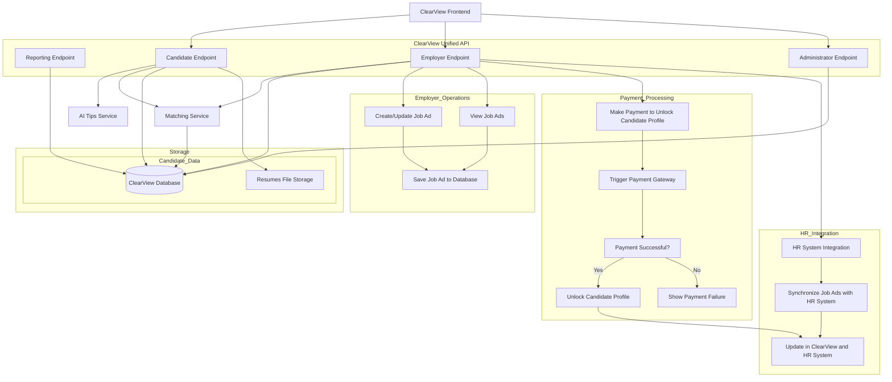

# Integration 

This diagram illustrates how ClearView connects to external systems and orchestrates payment processing, HR system synchronization, and internal data flows.

<i>External Systems Integration - Component Diagram</i>
