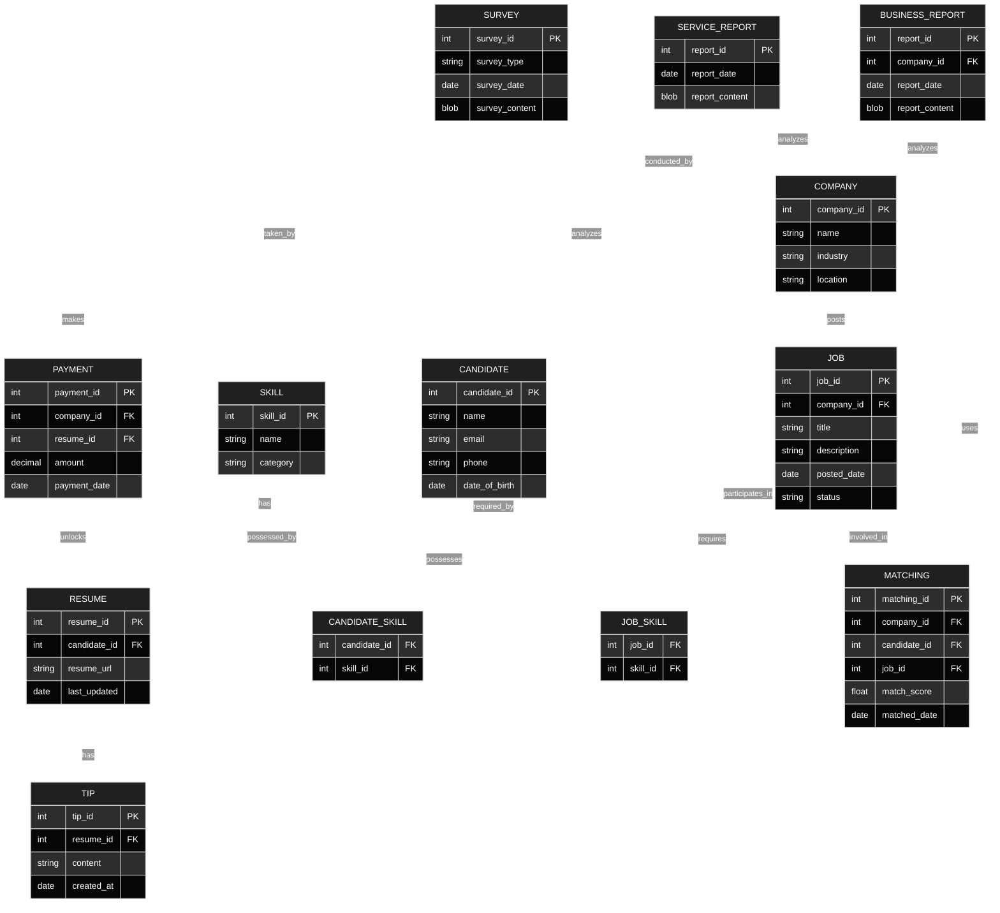

Based on domain we modeled this is the database structure we designed.

```mermaid
%%{init: {
  'theme': 'dark',
  'themeVariables': {
    'primaryColor': '#BB86FC',
    'primaryTextColor': '#fff',
    'primaryBorderColor': '#fff',
    'lineColor': '#fff',
    'secondaryColor': '#03DAC6',
    'tertiaryColor': '#333333',
    'textColor': '#fff'
  }
}}%%
erDiagram
    CANDIDATE ||--o| RESUME : has
    RESUME ||--o{ TIP : has
    CANDIDATE ||--o{ CANDIDATE_SKILL : possesses
    SKILL ||--o{ CANDIDATE_SKILL : possessed_by
    COMPANY ||--o{ JOB : posts
    JOB ||--o{ JOB_SKILL : requires
    SKILL ||--o{ JOB_SKILL : required_by
    COMPANY ||--o{ MATCHING : uses
    CANDIDATE ||--o{ MATCHING : participates_in
    JOB ||--o{ MATCHING : involved_in
    COMPANY ||--o{ PAYMENT : makes
    PAYMENT ||--|| RESUME : unlocks
    BUSINESS_REPORT ||--o{ COMPANY : analyzes
    SERVICE_REPORT ||--o{ CANDIDATE : analyzes
    SERVICE_REPORT ||--o{ COMPANY : analyzes
    SURVEY ||--o{ CANDIDATE : taken_by
    SURVEY ||--o{ COMPANY : conducted_by

    CANDIDATE {
        int candidate_id PK
        string name
        string email
        string phone
        date date_of_birth
    }

    RESUME {
        int resume_id PK
        int candidate_id FK
        string resume_url
        date last_updated
    }

    TIP {
        int tip_id PK
        int resume_id FK
        string content
        date created_at
    }

    JOB {
        int job_id PK
        int company_id FK
        string title
        string description
        date posted_date
        string status
    }
    
    SKILL {
        int skill_id PK
        string name
        string category
    }

    CANDIDATE_SKILL {
        int candidate_id FK
        int skill_id FK
    }

    JOB_SKILL {
        int job_id FK
        int skill_id FK
    }

    COMPANY {
        int company_id PK
        string name
        string industry
        string location
    }

    MATCHING {
        int matching_id PK
        int company_id FK
        int candidate_id FK
        int job_id FK
        float match_score
        date matched_date
    }

    PAYMENT {
        int payment_id PK
        int company_id FK
        int resume_id FK
        decimal amount
        date payment_date
    }

    BUSINESS_REPORT {
        int report_id PK
        int company_id FK
        date report_date
        blob report_content
    }

    SERVICE_REPORT {
        int report_id PK
        date report_date
        blob report_content
    }

    SURVEY {
        int survey_id PK
        string survey_type
        date survey_date
        blob survey_content
    }
```
